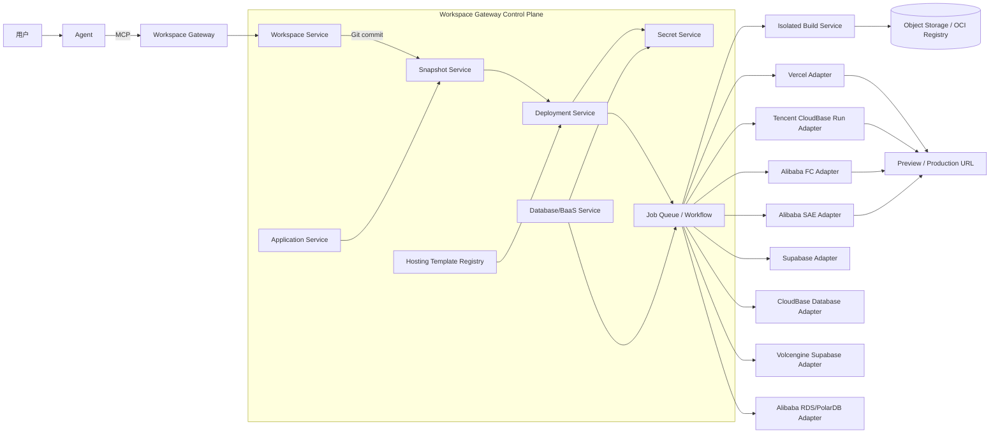
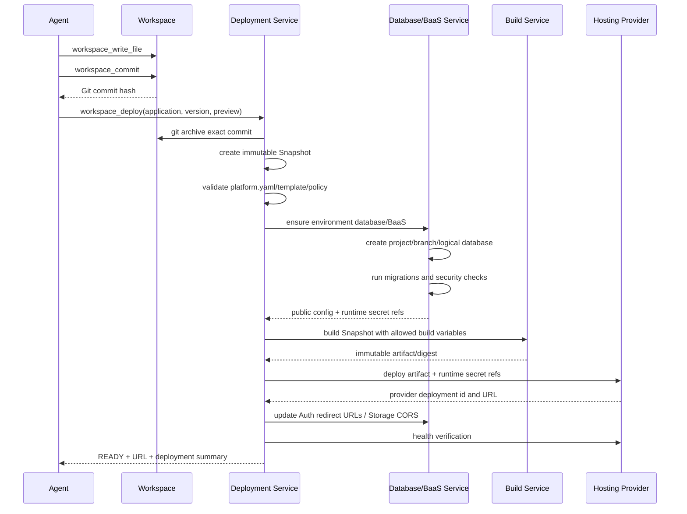
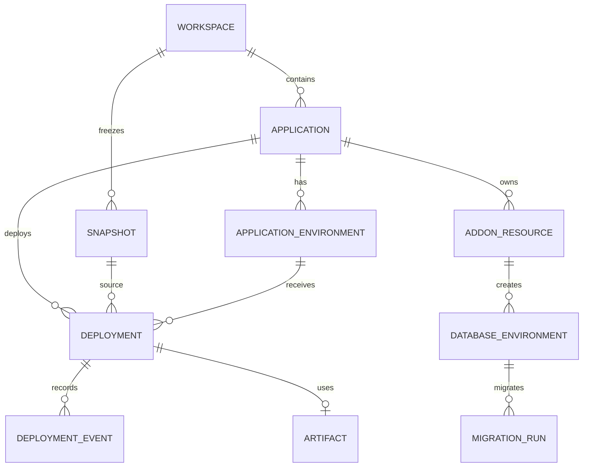

# Workspace Gateway 云托管接入技术方案

> 方案日期：2026-08-20
> 目标：在现有 Workspace-first 架构上增加云托管和数据库/BaaS 能力，把 Workspace 中的不可变代码版本部署到 Vercel、CloudBase Run、阿里云 FC/SAE 等托管平台，并支持 Supabase 类数据库、认证、存储和实时服务。

## 1. 输入材料分析

本方案基于以下已合并材料：

- [云托管平台技术调研](./云托管平台技术调研.md)；
- [云托管数据库调研](./云托管数据库调研.md)；
- [Workspace 持久化代码与 Sandbox 运行方案](./workspace-architecture.md)；
- [Workspace-first MCP 接入技术方案](./mcp-integration.md)。

原数据库专项材料中的“唯一默认 Provider”等历史结论已在合并时撤回，不进入本方案。

### 1.1 已有材料中可以直接采用的结论

1. 主链路应该是 `Workspace → 不可变 Snapshot → Build/Deploy`，GitHub/GitLab 只是可选导入导出通道，不是部署必经路径。
2. 云托管部署是分钟级异步工作流，不能使用当前 `workspace_run` 的单次同步调用模型。
3. Vercel 适合 Next.js、前端和兼容的 Serverless 项目，不是任意 Dockerfile 的统一底座。
4. CloudBase Run、SAE 等容器 PaaS 更适合通用 Web 容器；FC 更适合函数和无状态 API。
5. 数据库/BaaS 的生命周期属于 Application/Environment，不属于单次 Deployment。
6. Supabase 类产品需要同时处理数据库、Auth、Storage、Realtime、Data API、密钥和 Preview Branch，不能只抽象成一个 `DATABASE_URL`。
7. Build Secret、Runtime Secret、浏览器可公开配置必须严格分层。
8. Migration 失败必须阻止新版本上线，但不能影响旧生产版本继续服务。

### 1.2 需要在新方案中纠正的问题

现有材料存在以下需要统一的地方：

- 一份材料强调“完成同口径 POC 前不做最终选型”，另一份仍保留“火山 Supabase 是唯一默认主方案”的文字。新方案把“能力调研”“当前路由默认值”“最终厂商选型”分开管理，未通过 POC 的 Provider 不写成最终事实。
- `Project`、`Workspace`、`Application` 在材料中有时混用。新方案规定 Workspace 是源码容器，Application 是可部署应用；一个 Workspace 可以是 Monorepo，并包含多个 Application。
- Sandbox Template 与 Hosting Template 语义不同，不能复用同一个模板目录或数据表。
- Sandbox Preview 是短期开发运行入口；Cloud Hosting Deployment 是可长期运行、可发布和回滚的托管版本，两者不能共用生命周期状态。
- 生产 OCI 构建不能默认依赖 code-interpreter Sandbox 内的 Docker daemon。构建执行面应是独立的 Rootless BuildKit、Kaniko、Buildpacks 或云厂商构建服务。

## 2. 最终架构结论

项目扩展后采用四层模型：

```text
Workspace Source Plane
    ↓ 固定 Git commit
Application / Snapshot Plane
    ↓ 不可变源码快照
Build & Hosting Deployment Plane
    ↓ 不可变产物和托管版本
Database / BaaS Add-on Plane
    ↓ Environment 级长期资源
```

完整架构：



Sandbox Runtime 继续保留，用于：

- Agent 开发阶段的命令、测试和临时预览；
- Snapshot 的预检查和测试；
- 受控 Migration Dry Run；
- 不产生长期托管资源的快速验证。

Cloud Hosting 用于：

- 长期 Preview、Staging 和 Production；
- Provider 管理的 HTTPS URL、域名、扩缩容和运行日志；
- 不可变版本发布、Promote 和 Rollback；
- 与数据库/BaaS Environment 建立稳定绑定。

## 3. 核心领域模型

### 3.1 Workspace

Workspace 继续是源码事实来源：

```text
Workspace
├── Git working tree
├── Git commit history
└── one or more deployable roots
```

Agent 所有源代码 read/write 仍只操作 Workspace，不直接编辑托管平台文件，也不把云端构建目录当作源码来源。

### 3.2 Application

Application 是 Workspace 中一个可独立部署的应用：

```text
Application
├── workspace_id
├── root_directory
├── hosting_template_id
├── region_profile
├── default_environment
└── database_addon_policy
```

一个简单 Workspace 默认自动创建一个 Application；Monorepo 可以声明：

```text
workspace ws_xxx
├── apps/web       → app_web
├── apps/api       → app_api
└── packages/shared
```

### 3.3 Snapshot

Snapshot 是部署的唯一源码输入：

```text
Snapshot
├── workspace_id
├── workspace_version       # 完整 Git commit hash
├── root_directory
├── source_digest           # sha256
├── manifest_digest
├── object_storage_key
├── file_count / total_size
└── created_at
```

Snapshot 必须从已提交版本生成，不能直接读取仍在变化的 Workspace working tree。当前 `WorkspaceService` 已有 `git archive <commit>` 能力，可以抽取为独立 Snapshot Service 并复用。

### 3.4 Deployment

Deployment 表示一个不可变托管版本：

```text
Deployment
├── application_id
├── snapshot_id
├── environment             # preview / staging / production
├── hosting_provider
├── provider_project_id
├── provider_deployment_id
├── artifact_digest
├── database_environment_id
├── status
├── preview_url
├── production_url
└── timestamps
```

重新发布必须创建新的 Deployment；Production 只是一个 Alias、Route 或流量指针，不改变历史 Deployment。

### 3.5 Environment

Environment 是运行配置和长期资源边界：

```text
Application
├── production environment
│   ├── current deployment
│   ├── database/BaaS production resource
│   ├── runtime secrets
│   └── domains
└── preview environments
    ├── deployment
    ├── database branch/logical database
    ├── temporary secrets
    └── expires_at
```

删除 Deployment 不自动删除生产数据库；删除 Preview Environment 可以按策略级联删除 Preview Branch 或临时逻辑数据库。

## 4. Workspace 到云托管的完整流程



关键顺序：

1. Agent 在 Workspace 写代码并提交。
2. `workspace_deploy` 原子创建 Snapshot 和 Deployment，立即返回 `deployment_id`。
3. Worker 解析 `platform.yaml` 并锁定 Hosting Template 版本。
4. 如果声明数据库/BaaS，先准备对应 Environment，获取公共构建配置和 Secret 引用。
5. 独立 Migration Job 执行版本化迁移。
6. Build Service 或 Vercel 构建不可变产物。
7. Hosting Adapter 创建托管版本并注入运行期环境变量。
8. 获得应用 URL 后，再更新 Supabase Auth Redirect URL、Storage CORS 等反向依赖。
9. 健康检查通过后标记 READY；Promote 是单独操作。

## 5. 部署清单与 Hosting Template

### 5.1 platform.yaml

Workspace 可以包含受控部署意图：

```yaml
apiVersion: workspace-gateway.dev/v1alpha1
kind: Application

application:
  rootDirectory: .

build:
  preset: nextjs
  packageManager: npm

runtime:
  type: serverless-web
  port: 3000
  healthCheck:
    path: /

addons:
  database:
    profile: supabase
    engine: postgres
    migrations: supabase/migrations
    seed: supabase/seed.sql
    previewIsolation: branch
    features:
      auth: true
      storage: true
      realtime: false

env:
  public:
    - NEXT_PUBLIC_SUPABASE_URL
    - NEXT_PUBLIC_SUPABASE_PUBLISHABLE_KEY
  runtimeSecrets:
    - SUPABASE_SECRET_KEY
```

`platform.yaml` 只声明能力和变量名，禁止出现真实密码、Access Token、Service Role Key、云 AK/SK 或数据库管理员连接串。

### 5.2 Hosting Template 与 Sandbox Template 分离

新增独立 Hosting Template Registry：

```text
hosting_templates
├── vercel-nextjs
├── cloudbase-docker-web
├── aliyun-fc-web
└── aliyun-sae-container
```

Sandbox Template Registry 继续管理：

```text
sandbox_templates
├── code-interpreter
├── browser
└── custom runtime templates
```

二者不能复用，因为它们的 Provider、参数、版本、计费和生命周期完全不同。

Hosting Template 保存：

- build preset 与版本；
- 允许的框架和包管理器；
- Dockerfile/Buildpacks 规则；
- 允许的基础镜像；
- CPU、内存、实例数和超时上限；
- 支持的 Hosting Provider 与 Region Profile；
- 支持的 Database/BaaS Profile；
- 环境变量分类；
- 健康检查与域名策略；
- 安全扫描和发布 Gate。

## 6. Hosting Provider 适配器

### 6.1 统一接口

```text
HostingProviderAdapter
├── validate_connection()
├── capabilities()
├── ensure_application(application, template)
├── deploy_source(snapshot, environment, env_refs)
├── deploy_artifact(artifact, environment, env_refs)
├── get_deployment(provider_deployment_id)
├── get_logs(provider_deployment_id, cursor)
├── cancel(provider_deployment_id)
├── promote(provider_deployment_id)
├── rollback(application, target_provider_deployment_id)
├── bind_domain(application, domain)
└── delete_deployment(provider_deployment_id)
```

Provider 通过 Capability 表达差异，不强行假设所有平台支持相同能力：

```text
source_upload
oci_image
serverless_function
long_running_service
websocket
scale_to_zero
preview_url
promotion
rollback
custom_domain
webhook
runtime_secret_reference
```

### 6.2 Provider 路由

Agent 不传 Provider。控制面依据以下信息选择：

```text
hosting_template
+ environment
+ region_profile
+ required_capabilities
+ tenant policy
+ quota/cost policy
```

建议路由配置：

| Profile | Hosting | Database/BaaS | 说明 |
|---|---|---|---|
| `global-nextjs` | Vercel | Supabase Cloud / Neon | 海外 Next.js 与 Serverless |
| `cn-cloudbase-web` | CloudBase Run | CloudBase for Supabase/MySQL | 国内容器与 BaaS 同控制面 |
| `cn-aliyun-function` | FC 3.0 | RDS/PolarDB | 国内函数和无状态 API |
| `cn-aliyun-container` | SAE | RDS/PolarDB Supabase | 国内常驻容器与 VPC 数据库 |
| `cn-supabase-baas` | 由 Hosting Profile 决定 | 火山 Supabase | 需先验证跨云/同云计算组合与网络 |

Hosting 与 Database 不应任意笛卡尔积组合。默认要求计算和数据库尽量同地域、同云或低延迟网络，跨云连接必须经过显式 POC 和成本/合规评估。

### 6.3 Provider 差异映射

#### Vercel

- 从 Snapshot 生成文件摘要清单并去重上传；
- 使用 Vercel Project + Deployment；
- 通过 Project Environment Variables 注入公共构建变量和服务端运行变量；
- Preview URL 原生生成；
- Production 使用 Promote/Alias；
- 只允许兼容模板，不接受任意长期 Docker 进程。

#### Tencent CloudBase Run

- POC 可直接上传 Snapshot ZIP；
- 标准生产链路优先部署带 digest 的 OCI 镜像；
- CloudBase Environment 作为网络和资源池边界；
- 使用异步任务查询、版本发布、灰度和回滚；
- 与 CloudBase Database/BaaS 组合时优先使用同 Environment 或受支持私网路径。

#### Alibaba FC 3.0

- Function Template 转换为代码 ZIP 或 Custom Container；
- 创建 Function Version 和 Alias；
- HTTP Trigger/Custom Domain 作为入口；
- 适合无状态、按请求弹性服务，不作为常驻容器默认底座。

#### Alibaba SAE

- 由 Build Service 生成 OCI 镜像并推送 ACR；
- 使用不可变 digest 部署应用版本；
- 适合常驻 Web、容器和微服务；
- 与 RDS/PolarDB 放入同地域、同 VPC。

## 7. Build Service

### 7.1 为什么不能直接复用普通 Sandbox

当前 Sandbox Runtime 适合运行 `npm install`、测试和开发预览，但 OCI 构建通常需要：

- Rootless BuildKit、Kaniko 或 Buildpacks；
- Registry 推送权限；
- 分层缓存；
- SBOM、签名和 Provenance；
- 受控的基础镜像与网络；
- 与普通用户运行 Sandbox 不同的安全策略。

因此 Build Service 与 Sandbox Service 逻辑独立。即使底层暂时都使用 MicroVM，也必须使用不同模板、身份、网络和权限。

### 7.2 构建类型

```text
vercel-source
    Snapshot → Vercel file manifest → Vercel Build

static-site
    Snapshot → isolated npm build → static artifact

function-zip
    Snapshot → dependency/vendor packaging → immutable ZIP

oci-image
    Snapshot → Rootless BuildKit/Buildpacks → OCI digest
```

### 7.3 构建安全

- 不挂载宿主 Docker Socket；
- 不允许 privileged；
- 固定基础镜像 allowlist；
- 构建网络默认受限，依赖下载走代理；
- Build Secret 使用短时挂载，不进入 layer、日志或镜像配置；
- 扫描源码 Secret、恶意文件、License 和依赖漏洞；
- 产出 `source_digest + template_version + artifact_digest + SBOM`；
- 相同输入允许命中构建缓存，但缓存必须按租户和敏感度隔离。

## 8. Database/BaaS Add-on 统一模型

### 8.1 为什么是 Add-on，而不是 Hosting Provider 的一个字段

Supabase、Neon、CloudBase Database、火山 Supabase、RDS/PolarDB 的生命周期通常长于应用 Deployment。它们可能被多个 Deployment 复用，并包含独立的网络、备份、分支、密钥和计费。

因此新增独立接口：

```text
DatabaseAddonAdapter
├── capabilities()
├── provision_application_resource(application, profile, region)
├── wait_until_ready(resource_id)
├── create_environment(resource_id, environment, source_environment)
├── get_public_config(environment_id)
├── issue_runtime_credentials(environment_id, application_id)
├── issue_migration_credentials(environment_id, deployment_id)
├── apply_migrations(environment_id, snapshot, migration_plan)
├── configure_auth_redirects(environment_id, urls)
├── configure_storage_cors(environment_id, origins)
├── get_status(resource_id)
├── rotate_credentials(resource_id)
├── backup(resource_id)
├── delete_preview_environment(environment_id)
└── delete_application_resource(resource_id)
```

Capabilities 至少包括：

```text
postgres / mysql
database_protocol
data_api
auth
storage
realtime
edge_functions
database_branch
scale_to_zero
private_network
project_transfer
```

### 8.2 隔离等级

| 等级 | 模型 | 适用场景 |
|---|---|---|
| `branch` | 每个 Preview 一个原生数据库/BaaS Branch | Supabase、Neon、火山 Supabase |
| `environment` | 每个 Preview 一套独立 BaaS Environment | CloudBase 等无 Branch 产品 |
| `logical_database` | 共享实例内独立 Database + Role | RDS/CloudBase MySQL Preview |
| `schema` | 共享 PostgreSQL 内独立 Schema + Role | 仅内部低风险 POC |
| `dedicated` | 每个正式应用独立 Project/Instance | 标准生产或敏感项目 |

平台记录实际隔离方式，不能把 Migration Preview 冒充 Database Branch。

## 9. Supabase 类数据库接入

### 9.1 资源映射

推荐模型：

```text
一个 Production Application
└── 一个 Supabase Project / Workspace
    ├── Production/default branch
    ├── Preview branch dep_001
    ├── Preview branch dep_002
    ├── Auth
    ├── Storage
    ├── Realtime
    └── API Keys
```

对于不支持 Branch 的 Supabase 兼容产品，Provider Adapter 必须明确降级为独立 Environment、逻辑 Database 或不支持 Preview 数据隔离。

### 9.2 环境变量分层

#### 浏览器可公开配置

```text
NEXT_PUBLIC_SUPABASE_URL
NEXT_PUBLIC_SUPABASE_PUBLISHABLE_KEY
VITE_SUPABASE_URL
VITE_SUPABASE_PUBLISHABLE_KEY
```

Publishable Key 可以进入前端构建产物，但前提是：

- 所有暴露表启用 RLS；
- Storage Bucket 策略正确；
- Auth Redirect URL 只允许受控域名；
- 发布前运行安全 Advisor/RLS 检查。

#### 服务端 Runtime Secret

```text
SUPABASE_SECRET_KEY
SUPABASE_SERVICE_ROLE_KEY（兼容旧项目时）
DATABASE_URL（仅确有服务端直连需要时）
```

这些值只通过 Hosting Provider 的 Runtime Secret 能力注入。禁止使用 `NEXT_PUBLIC_`、`VITE_` 等会进入浏览器 Bundle 的前缀。

#### Migration Secret

```text
MIGRATION_DATABASE_URL
MIGRATION_ROLE_PASSWORD
```

只提供给独立 Migration Job，执行后立即吊销或轮换。普通应用 Runtime 不应该持有数据库管理员权限。

### 9.3 Serverless 数据库连接

- Vercel/FC 等短生命周期函数优先使用 Transaction Pooler，并设置较小的每实例连接上限；
- SAE/CloudBase Run 等长驻容器使用 Session Pooler 或受控 Direct Connection；
- Data API 优先用于浏览器和轻量业务，不把管理员数据库连接串暴露给前端；
- 自动扩容上限必须和数据库最大连接数联动校验；
- 健康检查不能每次创建不释放的新连接。

### 9.4 Preview 数据

- Preview Branch 默认只执行 Migration 和 Seed；
- 不自动复制生产数据；
- 需要业务数据时，只能使用合成数据或经过审批的脱敏数据集；
- Preview Environment 设置 TTL；
- 删除 Preview Deployment 后异步清理 Branch、临时账号、Secret、Storage 测试对象和 Auth 测试用户。

### 9.5 Auth 与 Storage 的部署后配置

应用部署前还不知道最终 Preview URL，因此采用两阶段配置：

```text
创建 Supabase Environment
→ 获取 URL 和 Publishable Key
→ 构建并部署应用
→ 获得 Hosting Preview URL
→ 更新 Auth Redirect Allowlist
→ 更新 Storage CORS
→ 执行 Auth/Storage 健康检查
→ Deployment READY
```

## 10. Migration 设计

### 10.1 目录约定

Supabase Profile：

```text
supabase/migrations/<timestamp>_<name>.sql
supabase/seed.sql
```

通用数据库 Profile：

```text
db/migrations/<version>_<name>.sql
db/seed.sql
```

### 10.2 Migration Runner

Migration Runner：

- 独立于用户应用和 Build Service；
- 从 Snapshot 读取迁移，不能读取可变 Workspace；
- 记录文件路径、SHA256、执行顺序和结果；
- 已在 Production 执行的迁移 checksum 不允许变化；
- 使用短期 Migration Role；
- 日志脱敏，不输出连接串和 SQL 参数中的 Secret；
- 支持超时、取消、重试策略和人工审批 Gate；
- 破坏性 SQL 在 Production 需要策略阻断或人工批准。

### 10.3 发布与回滚

数据库不会随应用版本自动回滚。生产迁移采用 expand/contract：

```text
先增加兼容字段/表
→ 部署兼容新旧结构的应用
→ 切换生产流量
→ 观察稳定
→ 后续版本再删除旧结构
```

Deployment Rollback 只切回旧应用版本。数据库恢复、PITR 或反向 Migration 是独立高风险操作。

## 11. Secret 管理

### 11.1 Secret 分类

| 类型 | 示例 | 可见范围 |
|---|---|---|
| Control Plane Secret | Vercel Token、云 AK/SK、Supabase PAT | Provider Adapter |
| Build Public Config | Supabase URL、Publishable Key | 允许进入浏览器 Bundle |
| Build Secret | 私有依赖 Token | 单次 Build Secret Mount |
| Runtime Secret | DB URL、Supabase Secret Key | 指定 Application Environment |
| Migration Secret | 管理/迁移数据库角色 | 单次 Migration Job |

### 11.2 存储要求

- 数据库只保存 `secret_ref`，不保存明文；
- 生产使用云 Secret Manager/KMS 或 Vault；
- Provider Configuration API 永不返回密钥；
- Agent、MCP、Workspace、Snapshot、构建日志和普通错误响应都不能看到 Secret；
- Secret 更新采用版本化引用，并支持轮换和吊销；
- Deployment 记录注入了哪些 Secret 名称和版本，不记录值。

## 12. 异步工作流与状态机

### 12.1 为什么必须异步

云数据库创建、依赖构建、镜像上传和托管发布可能耗时数分钟。HTTP/MCP 工具不能持续阻塞等待全部完成。

`workspace_deploy` 应立即返回：

```json
{
  "deployment_id": "dep_xxx",
  "status": "QUEUED"
}
```

Agent 使用 `deployment_get` 和 `deployment_logs` 查询进度。

### 12.2 Deployment 状态机

```text
QUEUED
→ SNAPSHOTTING
→ VALIDATING
→ PROVISIONING_ADDONS
→ MIGRATING
→ BUILDING
→ DEPLOYING
→ CONFIGURING_INTEGRATIONS
→ VERIFYING
→ READY
→ PROMOTED

执行态 → FAILED / CANCELED
PROMOTED → ROLLED_BACK（业务事件）
```

状态记录 `stage + reason_code + user_message + retryable`，不能只返回模糊的 `Provider operation failed`。

### 12.3 MVP 队列

MVP 可以使用 PostgreSQL Job 表和 `FOR UPDATE SKIP LOCKED` 实现 Worker：

```text
deployment_jobs
├── id
├── deployment_id
├── stage
├── payload_json
├── attempt
├── available_at
├── locked_by
├── locked_at
└── status
```

规模化后再迁移到 Temporal、云工作流或专用任务系统。所有步骤必须支持幂等，Provider Webhook 需要按 `provider_event_id` 去重。

## 13. 数据模型

建议新增：

```text
applications
hosting_provider_connections
hosting_templates
workspace_snapshots
artifacts
deployments
deployment_events
deployment_jobs
application_environments
environment_secret_bindings
addon_resources
database_environments
migration_runs
domains
provider_webhook_events
```

### 13.1 关键关系



### 13.2 与现有表的边界

- `workspaces`：继续保存源码工作区；
- `workspace_runs`：继续记录 Sandbox 临时执行，不改成 Hosting Deployment；
- `sandboxes`：继续记录临时执行实例；
- `provider_configurations`：继续仅保存 Sandbox Provider；
- `sandbox_templates`：继续仅保存 Sandbox Template；
- 新 Hosting、Database Provider 使用独立表和配置页面。

项目从当前内联 `CREATE TABLE IF NOT EXISTS` 扩展到大量业务表前，应引入 Alembic 或等价 Schema Migration，不再依赖启动时逐列补丁。

## 14. REST API

### 14.1 Application

```http
POST /v1/applications
GET  /v1/applications
GET  /v1/applications/{application_id}
```

请求示例：

```json
{
  "workspace_id": "ws_xxx",
  "name": "music-player",
  "root_directory": ".",
  "hosting_template_id": "hosttpl_vercel_nextjs",
  "region_profile": "global-nextjs"
}
```

### 14.2 Deployment

```http
POST /v1/applications/{application_id}/deployments
GET  /v1/deployments/{deployment_id}
GET  /v1/deployments/{deployment_id}/logs?cursor=...
POST /v1/deployments/{deployment_id}/cancel
POST /v1/deployments/{deployment_id}/promote
POST /v1/applications/{application_id}/rollback
DELETE /v1/deployments/{deployment_id}
```

部署请求：

```json
{
  "workspace_version": "4ebc536a...",
  "environment": "preview",
  "idempotency_key": "client-generated-key"
}
```

如果显式传入 `workspace_version`，服务端不得再次自动提交；如果省略版本且允许 `auto_commit`，Gateway 先创建一个明确提交并把最终 commit 写入 Snapshot。

### 14.3 Database/BaaS

```http
POST   /v1/applications/{application_id}/addons/database
GET    /v1/applications/{application_id}/addons/database
GET    /v1/database-environments/{database_environment_id}
GET    /v1/deployments/{deployment_id}/migrations
POST   /v1/addon-resources/{addon_resource_id}/rotate-credentials
DELETE /v1/database-environments/{database_environment_id}
```

普通读取接口只返回：

- Provider、Region、Engine 和能力；
- 状态、Branch/Environment 类型；
- Secret 名称和是否已绑定；
- 非敏感 Endpoint；
- Migration 状态和脱敏日志。

不返回数据库密码、Secret Key、Service Role Key、PAT 或云 AK/SK。

### 14.4 管理接口

```http
/v1/hosting-providers
/v1/hosting-provider-connections
/v1/hosting-templates
/v1/database-providers
/v1/database-provider-connections
/v1/region-profiles
```

Provider Connection 与 Template 必须分开。配置 Hosting Provider 时不要求填写 Hosting Template ID；数据库 Provider 连接也不绑定具体 Application。

## 15. MCP 工具

Agent 面向 Workspace 和 Deployment，不面向云账号：

```text
workspace_deploy
deployment_get
deployment_logs
deployment_promote
deployment_cancel
database_status
migration_logs
```

建议参数：

```text
workspace_deploy(
    workspace_id,
    application_id?,
    version?,
    environment="preview"
)
```

工具不接受：

- Hosting Provider；
- Database Provider；
- 云账号、区域 Endpoint 或 Token；
- 任意 Build Command；
- Secret 值；
- CPU/内存扩容参数。

这些选择来自后台 Hosting Template、Region Profile、租户套餐和平台策略。

创建数据库、Promote、Rollback、删除生产资源等会产生费用或外部影响的操作，应标记为需要明确用户授权；只读状态和日志工具不需要。

## 16. 管理页面

新增一级模块“云托管”，逻辑上与 Sandbox 管理分开：

```text
云托管
├── Applications
├── Deployments
├── Environments
├── Hosting Providers
├── Hosting Templates
├── Database/BaaS Providers
├── Database Resources
├── Domains
└── Usage & Audit
```

Application 详情页展示：

- 绑定 Workspace、Root Directory 和当前 Git 版本；
- Hosting Template 与 Region Profile；
- Production 和 Preview Deployment；
- Provider URL、自定义域名和健康状态；
- Database/BaaS 能力、环境、迁移状态；
- 环境变量名称和 Secret 是否已绑定；
- 构建日志、部署日志、用量和审计；
- Promote、Rollback、停止 Preview 和删除资源操作。

管理页面不能展示 Provider Token、数据库密码或服务端 Supabase Secret Key。

## 17. 安全边界

### 17.1 源码和 Snapshot

- 校验路径、符号链接、文件数量、单文件和总大小；
- `git archive` 不包含 `.git`；
- 扫描 `.env`、私钥、云密钥、数据库 URL 和高熵 Token；
- `.env.example` 只允许占位值；
- Snapshot 与 Artifact 都使用 SHA256，不可原地修改。

### 17.2 构建

- 用户代码属于不可信代码；
- CPU、内存、磁盘、PID、时长和出网受限；
- 不提供控制面数据库和云主账号权限；
- 不挂载宿主目录、Docker Socket 和平台源码；
- 构建输出扫描 Secret 和恶意产物。

### 17.3 运行

- 每个 Application Environment 独立 Secret 与服务身份；
- 运行账号只能访问自己的数据库/BaaS 资源；
- 设置实例数、连接数、请求量、流量和费用上限；
- 防止挖矿、扫描、代理、垃圾邮件和 DDoS 放大；
- Provider Webhook 验签并幂等处理。

### 17.4 数据库

- 前端 Publishable Key 必须结合 RLS；
- Secret/Service Role Key 仅后端可见；
- Runtime Role 与 Migration Role 分离；
- Production 默认删除保护和备份策略；
- Preview 不复制未脱敏生产数据；
- 数据删除、恢复、PITR 和权限变更必须审计。

## 18. 建议代码结构

在当前单仓库内逻辑拆分：

```text
src/workspace_gateway/
├── workspace/                  # 后续从现有 WorkspaceService 抽取
├── sandbox/                    # 现有 Sandbox Runtime
├── hosting/
│   ├── models.py
│   ├── service.py
│   ├── registry.py
│   ├── routes.py
│   ├── workflow.py
│   └── providers/
│       ├── base.py
│       ├── vercel.py
│       ├── cloudbase_run.py
│       ├── aliyun_fc.py
│       └── aliyun_sae.py
├── addons/
│   └── database/
│       ├── models.py
│       ├── service.py
│       ├── migration_runner.py
│       ├── registry.py
│       └── providers/
│           ├── base.py
│           ├── supabase.py
│           ├── cloudbase.py
│           ├── volcengine_supabase.py
│           └── aliyun_rds.py
├── artifacts/
├── secrets/
└── jobs/
```

不要立即拆成多个仓库或微服务；先在单体中建立清晰模块边界。Build Worker 和 Preview/Hosting 数据面可以作为独立进程运行。

## 19. 实施路线

### 阶段 0：控制面骨架

- 引入数据库 Schema Migration；
- 建立 Application、Snapshot、Deployment、Event 和 Job 表；
- 建立独立 Hosting/Database Provider Registry；
- 实现 Fake Hosting、Fake Database Provider 和完整状态机测试；
- 从 Git commit 生成 Snapshot、摘要和本地 Artifact；
- 提供 REST API，暂不向 MCP 暴露写操作。

### 阶段 1：首个端到端 Profile

根据目标市场选择一个完整垂直切片：

```text
海外验证：Vercel Next.js + Supabase Cloud
中国内地验证：CloudBase Run + CloudBase Database/BaaS
```

每条垂直切片必须跑通：

```text
Workspace commit
→ Snapshot
→ Database/BaaS Environment
→ Migration
→ Build/Deploy
→ Secret 注入
→ Preview URL
→ Auth Redirect/CORS
→ Health Check
→ Cleanup
```

数据库厂商未完成同口径 POC 前，不把火山、CloudBase、PolarDB Supabase 中任何一家写死为唯一实现。

### 阶段 2：国内多底座

- CloudBase Run OCI 镜像标准链路；
- Alibaba FC Function Profile；
- Build Service + ACR + SAE；
- CloudBase、火山 Supabase、PolarDB Supabase/RDS Adapter；
- Preview Branch/Environment/Logical Database 三类隔离；
- 管理后台 Provider、Template、Deployment 和 Database 页面。

### 阶段 3：Agent 与生产发布

- 发布最小 MCP 工具；
- 流式日志或游标日志；
- Promote、Rollback、Domain；
- 配额、预算、用量和账单；
- 多账号资源池、BYOC/OAuth、项目 Claim/Transfer；
- SLA、备份恢复和灾备。

## 20. 验收标准

### 20.1 Workspace 与可复现性

- 任意 Deployment 能追溯到准确 Workspace commit、Snapshot digest、Template version 和 Artifact digest；
- Workspace 后续修改不会改变正在构建或已经部署的版本；
- 相同 Snapshot 和 Template 可以重复构建并得到可验证产物。

### 20.2 部署

- API 在数秒内返回 `deployment_id`，耗时工作在 Worker 执行；
- 状态和日志可以持续查询；
- Provider 重试、Webhook 重复和 Worker 重启不会产生重复部署；
- 新版本失败不影响旧 Production；
- Promote/Rollback 不重新构建。

### 20.3 数据库/BaaS

- 每个项目和 Preview 的实际隔离模型可查询；
- Migration 失败阻止发布；
- Runtime Role 不能执行管理操作或访问其他项目；
- Supabase 前端只获得 Publishable Key，服务端 Secret 不出现在 Bundle；
- Preview TTL 到期后 Branch/Environment、临时账号和 Secret 被清理；
- Production 数据库不会因删除 Deployment 被误删。

### 20.4 安全与运营

- Agent 和浏览器无法读取云密钥、数据库密码和 Service Role Key；
- 构建环境无法访问控制面网络和其他租户资源；
- 项目级并发、资源、连接数和费用限制可执行；
- 资源创建、迁移、发布、回滚、密钥轮换和删除均有审计记录。

## 21. 最终建议

云托管扩展应围绕以下稳定主链路建设：

```text
Agent 编辑 Workspace
→ 提交 Git 版本
→ 创建不可变 Snapshot
→ 根据 Hosting Template 和 Region Profile 选择托管平台
→ 准备 Database/BaaS Environment 并执行 Migration
→ 构建不可变产物
→ 托管平台部署并注入 Runtime Secret
→ 返回 Preview URL
→ 验证后 Promote 到 Production
```

第一原则是 Workspace 仍然作为源码事实来源；第二原则是 Hosting、Sandbox、Database/BaaS 三类 Provider 完全分离；第三原则是数据库资源绑定 Application Environment，而不是单次 Deployment。

Supabase 类能力要按完整 BaaS 处理：前端 Publishable Key + RLS、后端 Secret、Migration Role、Auth Redirect、Storage CORS、Preview Branch 和长期生产资源缺一不可。这样才能在不泄露 Provider 凭据的前提下，把 Agent 生成的 Workspace 代码可靠部署到不同云托管平台。
