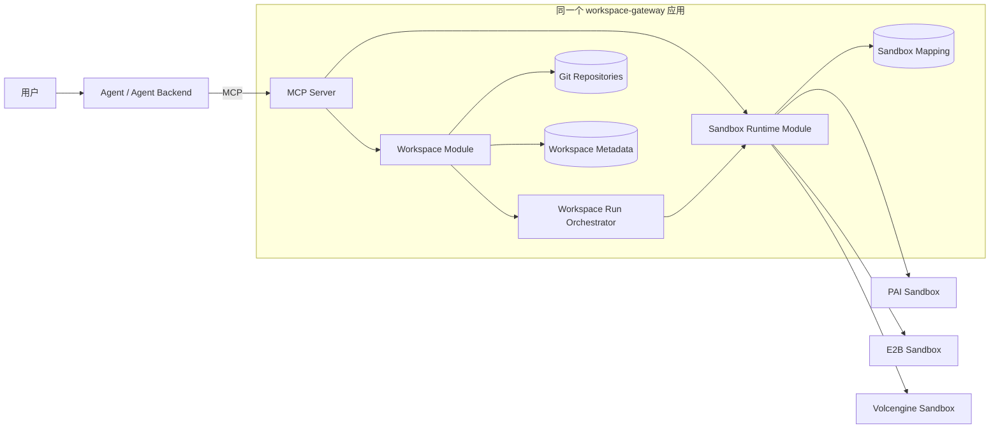

# Workspace-first MCP 接入技术方案

## 1. 结论

Coding Agent 必须以 Workspace 为工作对象，而不是以 Sandbox 文件系统为工作对象。

```text
源码读取、源码写入、版本管理 → Workspace
构建、测试、启动、预览       → Sandbox
```

Sandbox 是可销毁的临时执行环境，不能成为项目代码的事实来源。Agent 写完代码后先提交 Workspace 版本；需要运行时，再由 Workspace 编排层把指定版本同步到 Sandbox。

当前代码继续放在同一个 `workspace-gateway` 项目和同一个进程中，便于开发部署，但 Workspace 与 Sandbox 在领域模型、服务逻辑和 MCP 工具上保持独立。以后可以在不改变 Agent 协议的情况下拆成两个服务。

## 2. 总体架构



逻辑依赖方向：

```text
MCP/API Layer
   ├── Workspace Module
   │      └── Workspace Run Orchestrator ──→ Sandbox Runtime Module
   └── Sandbox Runtime Module

Sandbox Runtime Module 不反向依赖 Workspace Module
```

这是一种模块化单体结构：代码、数据库连接和部署单元暂时放在一起，但两个领域不共享业务职责。

## 3. 两个领域的职责

### 3.1 Workspace Module：代码资产层

Workspace 是 Agent 的主要工作区，负责：

- 创建项目工作区；
- 查看文件列表；
- 读取当前或历史版本文件；
- 创建、覆盖项目文件；
- 维护 Git working tree；
- 提交版本并返回 commit hash；
- 查看提交历史；
- 选择某个版本发起运行。

Workspace 生命周期长于 Agent 会话和 Sandbox。Sandbox 被销毁后，Workspace 代码必须继续存在。

### 3.2 Sandbox Runtime Module：临时执行层

Sandbox 只负责：

- 创建或连接远程运行环境；
- 接收 Workspace 生成的源码归档；
- 在 `/workspace` 解压指定版本；
- 执行构建、测试和启动命令；
- 管理后台进程和 Preview；
- 查询、暂停和销毁运行实例。

Sandbox 内产生的源码修改默认不回写 Workspace。依赖目录、构建产物、日志和临时文件也不属于项目源码版本。

### 3.3 Workspace Run Orchestrator：两个领域之间的桥

`workspace_run` 是 Agent 发起代码运行的唯一首选入口，编排流程为：

1. 检查 Workspace；
2. 可选地提交未保存修改；
3. 解析得到不可变 Git commit；
4. 创建默认模板 Sandbox，或者连接调用方提供的 Sandbox；
5. 从 Git commit 生成 `tar.gz`；
6. 通过 Sandbox Runtime 内部文件接口上传归档；
7. 清理 Sandbox `/workspace` 中的旧源码并解压；
8. 在 Sandbox 中执行命令；
9. 记录 Workspace ID、commit、Sandbox ID 和执行结果。

## 4. MCP 工具边界

### 4.1 Workspace 工具：Agent 编程主接口

| 工具 | 用途 |
|---|---|
| `workspace_create` | 创建持久化项目 |
| `workspace_get` | 查看当前版本、dirty 状态和文件数 |
| `workspace_list_files` | 查看项目代码文件 |
| `workspace_read_file` | 读取当前工作树或历史版本文件 |
| `workspace_write_file` | 创建或覆盖项目文件 |
| `workspace_commit` | 提交修改并获得不可变 commit hash |
| `workspace_history` | 查看版本历史 |
| `workspace_run` | 同步指定版本到 Sandbox 并执行 |

Agent 的 Read/Write/Edit 行为都必须映射到 Workspace 工具。

### 4.2 Sandbox 工具：运行时辅助接口

| 工具 | 用途 | 限制 |
|---|---|---|
| `sandbox_get` | 查询 `workspace_run` 返回的运行实例 | 只读状态 |
| `sandbox_run_command` | 对已同步的运行环境执行额外命令 | 仅用于运行诊断，不保存源码修改 |
| `sandbox_start_process` | 启动 Next.js 等后台服务 | 仅运行时 |
| `sandbox_get_preview` | 获取端口预览地址 | 只读 |
| `sandbox_pause` | 暂停运行实例 | 不影响 Workspace |
| `sandbox_kill` | 销毁运行实例 | 必须 `confirm=true`，不删除 Workspace |

### 4.3 不向 Agent 发布的工具

以下能力不再通过 MCP 发布：

| 不发布的工具 | 原因 |
|---|---|
| `sandbox_create` | Sandbox 应由 `workspace_run` 根据后台默认模板创建，避免出现没有源码归属的运行环境 |
| `sandbox_write_file` | 会绕过 Workspace 版本控制，让 Sandbox 成为隐式源码来源 |
| `sandbox_read_file` | Agent 应从 Workspace 读取源码；运行结果通过命令输出、日志或产物接口获取 |
| `sandbox_list` | 避免 Agent 枚举其他任务或用户的运行实例 |
| Provider/Template 查询 | Provider 和模板属于管理员控制面 |

底层 REST 文件接口仍保留在 Sandbox Runtime Module 内，供 Workspace Run Orchestrator 上传源码归档，也可以供受信任的运维接口使用。保留底层能力不等于把它暴露为 Agent 编程工具。

## 5. Agent 标准调用流程

### 5.1 创建和编辑项目

```text
workspace_create
  → workspace_list_files
  → workspace_read_file
  → workspace_write_file（多次）
  → workspace_commit
```

Agent Backend 应保存 `workspace_id`，并在后续对话中继续传入同一个 Workspace。

### 5.2 构建或测试

```text
workspace_run(
  workspace_id,
  command="npm install && npm test",
  auto_commit=true
)
```

返回 `run_id`、`workspace_id`、准确的 Git commit、Gateway Sandbox ID、命令结果，以及是否新建了 Sandbox。

### 5.3 启动 Next.js 并预览

```text
workspace_run(command="npm install && npm run build")
  → 保存返回的 sandbox.id
  → sandbox_start_process(command="npm run start -- --hostname 0.0.0.0")
  → sandbox_get_preview(port=3000)
  → sandbox_kill(confirm=true)
```

后台进程操作的是已同步代码的 Sandbox。若 Workspace 又产生新 commit，应再次调用 `workspace_run` 同步新版本，不能直接在 Sandbox 里修改源码。

## 6. 数据所有权和生命周期

| 数据 | 所有者 | 生命周期 | 是否版本化 |
|---|---|---|---|
| 项目源码和配置 | Workspace | 长期 | Git commit |
| Workspace metadata | Workspace Module | 长期 | 数据库记录 |
| `/workspace` 运行副本 | Sandbox | 临时 | 记录来源 commit，自身不作为版本 |
| `node_modules`、构建缓存 | Sandbox/缓存服务 | 临时或可回收 | 不进入源码 Git |
| stdout/stderr、运行记录 | Run Orchestrator | 按审计策略保留 | 关联 commit 和 Sandbox ID |
| Provider Token | Sandbox Runtime Module | 配置生命周期 | 禁止进入 Workspace/Sandbox metadata |

一个 Workspace 可以先后运行在多个 Sandbox；一个 Sandbox 在一次同步后对应一个明确的 Workspace commit。

## 7. 同项目部署、逻辑独立的代码结构

当前保持单仓库、单 Python 包、单 FastAPI 进程：

```text
src/workspace_gateway/
├── app.py                  HTTP 路由和模块装配
├── mcp_server.py           Workspace-first MCP 工具层
├── workspace_service.py    文件、Git 版本、归档和运行编排
├── service.py              Sandbox Runtime 编排
├── providers/              PAI/E2B/Volcengine Adapter
├── storage.py              共享数据库基础设施、领域记录分别建表
├── models.py               API 模型，按 Workspace/Sandbox 命名分组
└── web/                    同一个管理控制台
```

逻辑隔离约束：

- Workspace Service 不直接调用任何 Provider SDK；
- Workspace Service 只能通过 Sandbox Runtime Service 创建、写入归档和执行；
- Sandbox Runtime Service 不读取 Git 仓库，也不知道 Git 分支和 commit 语义；
- Provider Adapter 不包含 Workspace、用户项目或 Git 逻辑；
- MCP 的源码工具只调用 Workspace Service；
- REST、MCP、管理页共用领域服务，不重复实现业务规则。

后续代码量增大时，可以在同一项目中进一步整理为：

```text
workspace_gateway/workspaces/
workspace_gateway/sandboxes/
workspace_gateway/providers/
workspace_gateway/shared/
```

首期不急于拆微服务，避免引入分布式事务、远程文件传输和额外运维成本。

## 8. MCP 连接与安全边界

```text
URL: http://127.0.0.1:8080/mcp
Transport: Streamable HTTP
Authorization: Bearer <GATEWAY_API_KEY>
```

未设置 Gateway Key 的本地开发环境可以省略 Authorization。Provider Token 始终只保存在 Gateway，不会返回 Agent。

MCP 不提供 Provider 能力、配置状态、模板目录、Sandbox 列表或密钥读取工具。管理员在管理后台选择唯一默认模板；`workspace_run` 自动读取该模板。

当前全局 Gateway API Key 只适合本地或受信任内部环境。公网多用户部署前必须增加：

1. `tenant_id/user_id/project_id` 与 Workspace 所有权；
2. Workspace ID 和 Sandbox ID 的逐次授权校验；
3. OAuth/OIDC 或短期 JWT；
4. 文件、提交、运行、预览和销毁审计；
5. 命令、网络、CPU、内存、运行时长和并发配额；
6. Git 仓库持久卷、备份和恢复；
7. Provider Token 与远端 Git Token 的独立凭证代理。

不能只依赖“工具不提供列表”实现租户隔离；服务端仍必须检查每个 ID 的所有权。

## 9. 演进路线

### 阶段一：当前模块化单体

- Workspace 和 Sandbox 实现在同一项目；
- Workspace 使用本地 Git 仓库；
- Sandbox Runtime 接入 PAI、E2B、火山引擎；
- Workspace-first MCP，共 8 个 Workspace 工具和 6 个 Sandbox Runtime 工具；
- Agent 无法直接创建 Sandbox 或读写 Sandbox 源码文件。

### 阶段二：增强 Workspace

- 文件删除、重命名、目录批量写入和 Apply Patch；
- 分支、Diff、回滚、合并和冲突处理；
- 运行历史与源码版本对比；
- GitHub/GitLab/Gitee 导入和受控推送。

### 阶段三：增强运行系统

- 异步任务、流式日志和取消；
- 构建缓存与依赖缓存；
- 基于 commit 的不可变源码制品；
- Preview WebSocket 转发和多实例会话存储；
- Sandbox 池化与费用配额。

### 阶段四：按容量拆分

```text
Agent → Workspace Service → Git/Object Storage
                       ↓ source artifact
                 Sandbox Runtime → Providers
```

Agent 的 MCP 工具名和 `workspace_run` 语义保持不变，只改变服务内部调用方式。

## 10. 相关文档

- [MCP Client 接入指南](mcp-client-integration.md)
- [Workspace 持久化与运行方案](workspace-architecture.md)
- [Workspace Gateway 总体技术方案](technical-solution.md)
- [联调问题记录](debugging-issues-record.md)
- [MCP Python SDK](https://github.com/modelcontextprotocol/python-sdk)
