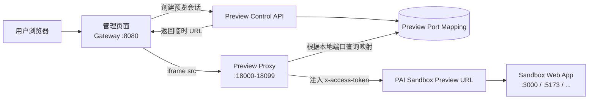
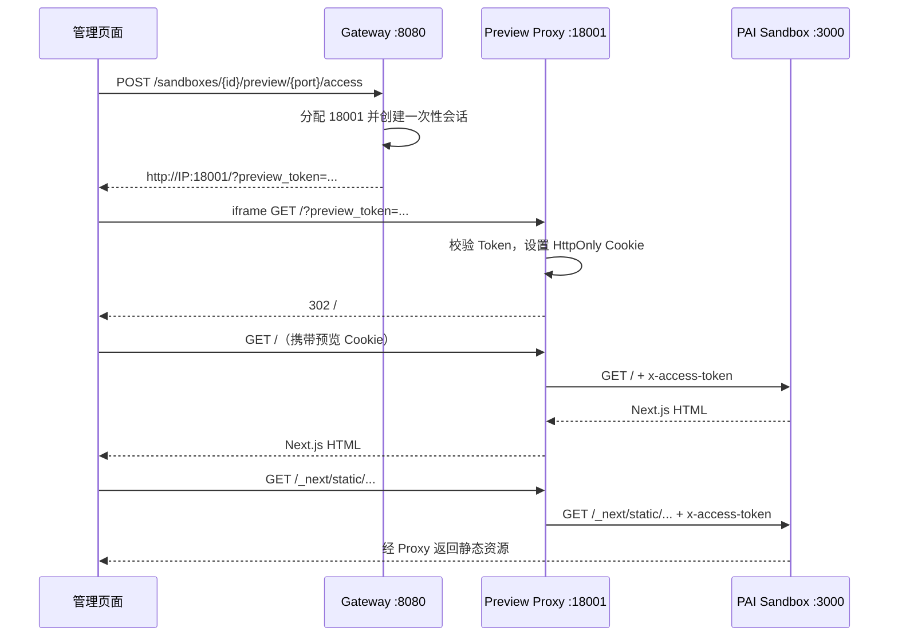

# Sandbox 预览端口池代理技术方案

## 1. 背景

PAI Sandbox 中运行的 Next.js、Vite 或其他 Web 服务，会获得类似下面的厂商预览地址：

```text
https://<sandbox-port>-<provider-sandbox-id>.<pai-sandbox-domain>/
```

访问该地址时需要携带实例级 `x-access-token`。普通浏览器页面和 `<iframe src="...">` 无法为页面导航及其后续 JS、CSS、图片、API、WebSocket 请求统一添加自定义 Header，因此不能由管理页面直接把 PAI Access Token 放入 iframe 请求。

当前路径代理地址：

```text
http://<gateway-host>:8080/v1/sandboxes/<gateway-sandbox-id>/proxy/3000/
```

虽然首页请求可以由 Gateway 注入 Token，但 Next.js 通常生成根路径静态资源：

```text
/_next/static/...
```

浏览器会访问 Gateway 根路径，而不是保留 `/v1/sandboxes/.../proxy/3000/` 前缀。Gateway 无法仅根据该请求判断目标 Sandbox，导致静态文件、根路径 API、页面跳转和 WebSocket 无法被可靠代理。

当前开发环境使用 IP 地址而不是可配置的通配符域名，因此本方案采用：

> 管理控制面固定端口 + Sandbox Preview 动态端口池 + Gateway 服务端注入 `x-access-token`

## 2. 目标与非目标

### 2.1 目标

- 管理页面继续运行在 `http://<gateway-ip>:8080/console`；
- 每个活动预览分配一个独立的 Gateway 外部端口；
- iframe 只访问 Gateway 返回的临时预览 URL；
- 页面及所有静态资源保持根路径，不修改用户项目；
- PAI `x-access-token` 只保存在 Gateway，不返回浏览器；
- 支持 HTTP、常见请求方法、流式响应和 WebSocket；
- Sandbox 销毁或预览过期后自动释放端口；
- 端口映射、访问会话和审计可以持久化。

### 2.2 非目标

- 不把 PAI Access Token 写入 iframe URL、前端 JavaScript或浏览器存储；
- 不通过重写任意 HTML、CSS 和 JavaScript 适配不同前端框架；
- 不要求用户项目配置 Next.js `basePath` 或 Vite `base`；
- 不把 Preview 当作 Workspace 代码存储或长期部署环境；
- 第一阶段不解决公网正式域名和自动 TLS 证书问题。

## 3. 推荐架构



控制面和预览数据面逻辑分离：

```text
Workspace Gateway Control Plane
└── 0.0.0.0:8080
    ├── /console
    ├── /mcp
    ├── /v1/workspaces
    ├── /v1/sandboxes
    └── Preview Session API

Sandbox Preview Proxy Data Plane
├── 0.0.0.0:18000
├── 0.0.0.0:18001
├── 0.0.0.0:18002
└── ...
```

一个 Preview Proxy 进程可以同时监听多个 Socket，不需要为每个端口启动一个操作系统进程。

## 4. URL 与端口映射

### 4.1 管理页面

```text
http://100.114.213.118:8080/console
```

### 4.2 Sandbox 预览

```text
Sandbox A → http://100.114.213.118:18001/
Sandbox B → http://100.114.213.118:18002/
Sandbox C → http://100.114.213.118:18003/
```

映射关系示例：

| 外部端口 | Gateway Sandbox ID | Sandbox 内端口 | Provider 预览地址 | 状态 |
|---:|---|---:|---|---|
| 18001 | `sbxgw_a...` | 3000 | `https://3000-sbx-a...` | active |
| 18002 | `sbxgw_b...` | 5173 | `https://5173-sbx-b...` | active |
| 18003 | - | - | - | available |

浏览器访问：

```text
http://100.114.213.118:18001/_next/static/chunks/app.js
```

Preview Proxy 根据本地目标端口 `18001` 找到映射，并转发为：

```http
GET /_next/static/chunks/app.js HTTP/1.1
Host: <PAI preview host>
x-access-token: <PAI Sandbox Access Token>
```

因此首页、静态资源、根路径 API 和客户端路由始终位于同一个 Preview Origin 下。

## 5. 完整访问流程



管理页面只保存 Gateway 预览 URL，不接触 Provider Token。

## 6. iframe 接入

管理页面调用 Preview Access API 后，把返回 URL 设置为 iframe 的 `src`：

```html
<iframe
  src="http://100.114.213.118:18001/?preview_token=<one-time-token>"
  sandbox="allow-scripts allow-forms allow-modals allow-downloads allow-popups allow-same-origin"
  referrerpolicy="no-referrer"
></iframe>
```

要求：

- iframe 与管理页面保持不同 Origin（端口不同即为不同 Origin）；
- iframe 不读取管理页面 DOM、Cookie 或 `sessionStorage`；
- 如需高度同步、运行状态或错误通知，使用受控 `postMessage` 协议；
- `postMessage` 必须验证明确的 `origin`，不能使用 `*`；
- 管理页面升级 HTTPS 后，Preview 也必须升级 HTTPS，否则会被浏览器拦截为混合内容。

## 7. Preview Session 设计

### 7.1 建议数据模型

```text
preview_sessions
├── id
├── token_hash
├── gateway_sandbox_id
├── provider
├── sandbox_port
├── external_port
├── upstream_url
├── encrypted_provider_headers
├── state
├── created_at
├── expires_at
└── last_accessed_at
```

关键要求：

- 数据库只保存 Token 哈希，不保存浏览器 Token 明文；
- Provider Header 使用服务端密钥加密，或运行时从 Provider Adapter 获取；
- 会话必须绑定 Sandbox ID、Sandbox 端口和外部端口；
- Token 第一次使用后可标记为已消费；
- Cookie 使用新的短期会话标识，不复用一次性 URL Token；
- Sandbox 被销毁后，关联会话立即失效。

### 7.2 Cookie

由于 Cookie 不按端口隔离，同一个 IP 下的多个 Preview 端口会收到相同域名的 Cookie。应使用带端口的 Cookie 名，并在服务端再次校验端口绑定：

```text
sandbox_preview_18001=<opaque-session-id>
sandbox_preview_18002=<opaque-session-id>
```

推荐属性：

```text
HttpOnly
SameSite=Lax
Path=/
Max-Age=900
Secure（启用 HTTPS 后）
```

浏览器收到的只是 Gateway Preview Session，不是 PAI `x-access-token`。即使同主机上的其他端口收到该 Cookie，也无法绕过服务端的端口、会话、Sandbox 和过期时间校验。

## 8. 多端口监听实现

### 8.1 第一阶段：启动时绑定固定端口池

启动时创建一批非阻塞监听 Socket，再交给同一个 ASGI Server：

```python
import socket


def create_preview_socket(port: int) -> socket.socket:
    sock = socket.socket(socket.AF_INET, socket.SOCK_STREAM)
    sock.setsockopt(socket.SOL_SOCKET, socket.SO_REUSEADDR, 1)
    sock.bind(("0.0.0.0", port))
    sock.listen(2048)
    sock.setblocking(False)
    return sock


preview_sockets = [
    create_preview_socket(port)
    for port in range(18000, 18100)
]
```

概念上的 ASGI 启动方式：

```python
config = uvicorn.Config(preview_app, loop="asyncio", lifespan="off")
server = uvicorn.Server(config)
await server.serve(sockets=preview_sockets)
```

请求处理时通过 ASGI Scope 获得本地端口：

```python
external_port = request.scope["server"][1]
mapping = preview_port_manager.get_active_mapping(external_port)
```

没有活动映射时返回：

```http
HTTP/1.1 410 Gone
Content-Type: application/json

{"detail":"Preview is not active"}
```

预先监听端口池的优点：

- 分配和释放只更新映射，不频繁创建或关闭 Socket；
- 一个事件循环处理全部连接；
- 不需要为每个 Sandbox 启动一个 Uvicorn 进程；
- 端口资源和最大并发预览数清晰可控。

### 8.2 进程模型

推荐运行两个进程：

```text
workspace-gateway       → 8080
workspace-preview-proxy → 18000-18099
```

二者共享 PostgreSQL/Redis 中的端口映射和会话数据。这样 Preview 大流量或用户项目异常不会阻塞控制面、MCP 和 Workspace API。

POC 阶段也可以在一个进程中使用两个异步任务启动，但生产环境应拆分故障域。

## 9. HTTP 与 WebSocket 转发

### 9.1 HTTP

Preview Proxy 应：

- 保留请求方法、路径、查询参数和请求体；
- 删除 hop-by-hop Header；
- 使用 Provider Adapter 返回的真实预览地址和实例级 Header；
- 覆盖上游 `Host`；
- 注入 `x-access-token`；
- 使用流式请求和流式响应，避免把大文件全部读入内存；
- 正确处理 `Content-Type`、缓存 Header、Range 请求和压缩；
- 将上游绝对重定向改写为当前 Preview Origin；
- 不把上游 Token 写入错误信息和日志。

### 9.2 WebSocket

需要代理：

- Next.js `/_next/webpack-hmr`；
- Vite HMR；
- 用户项目 WebSocket；
- Server-Sent Events 和长连接。

WebSocket 握手和上游连接同样需要注入 Provider Token。只实现 `httpx` HTTP 转发不足以支持开发服务器热更新。

## 10. API 设计

### 10.1 创建预览访问会话

```http
POST /v1/sandboxes/{gateway_sandbox_id}/preview/{sandbox_port}/access
```

返回：

```json
{
  "sandbox_id": "sbxgw_xxx",
  "sandbox_port": 3000,
  "external_port": 18001,
  "url": "http://100.114.213.118:18001/?preview_token=opaque-token",
  "expires_at": "2026-08-20T10:30:00Z"
}
```

重复请求可以选择：

- 复用同一个 Sandbox + Sandbox Port 的活动映射；或
- 创建新的独立会话但复用外部端口。

第一阶段推荐复用端口、创建新的一次性访问 Token。

### 10.2 查询预览

```http
GET /v1/sandboxes/{gateway_sandbox_id}/previews
```

只返回非敏感信息：

```json
[
  {
    "sandbox_port": 3000,
    "external_port": 18001,
    "url": "http://100.114.213.118:18001/",
    "state": "active",
    "expires_at": "2026-08-20T10:30:00Z"
  }
]
```

### 10.3 关闭预览

```http
DELETE /v1/sandboxes/{gateway_sandbox_id}/preview/{sandbox_port}
```

关闭 Preview 只释放外部端口映射，不一定销毁 Sandbox。销毁 Sandbox 时必须级联关闭所有 Preview。

## 11. 生命周期与端口分配

```text
创建访问会话
→ 查找是否已有活动映射
→ 没有则从端口池原子分配空闲端口
→ 保存映射并生成一次性 Token
→ 返回 iframe URL
→ 访问期间续期 last_accessed_at
→ 会话过期或 Sandbox 销毁
→ 端口映射失效
→ 端口重新进入 available 状态
```

端口分配必须使用数据库事务、唯一索引或 Redis 原子操作，避免两个 Gateway 实例分配同一个外部端口。

建议唯一约束：

```text
UNIQUE(external_port) WHERE state = 'active'
UNIQUE(gateway_sandbox_id, sandbox_port) WHERE state = 'active'
```

## 12. 配置

```env
GATEWAY_PREVIEW_MODE=port_pool
GATEWAY_PREVIEW_HOST=0.0.0.0
GATEWAY_PREVIEW_PUBLIC_HOST=100.114.213.118
GATEWAY_PREVIEW_PORT_START=18000
GATEWAY_PREVIEW_PORT_END=18099
GATEWAY_PREVIEW_SESSION_TTL_SECONDS=900
GATEWAY_PREVIEW_IDLE_TIMEOUT_SECONDS=900
```

开发机安全组、防火墙和 Tailscale ACL 需要允许：

```text
TCP 8080
TCP 18000-18099
```

如果使用 Docker Compose：

```yaml
ports:
  - "8080:8080"
  - "18000-18099:18000-18099"
```

不要把 Preview 端口段无认证暴露到公网。

## 13. 安全要求

- PAI Access Token 只能由 Provider Adapter 和 Preview Proxy 获取；
- 浏览器只持有短期、可撤销的 Gateway Preview Session；
- Preview Session 必须关联 tenant、user、workspace 和 sandbox；
- 管理 API 必须验证用户是否拥有目标 Workspace/Sandbox；
- 限制每个用户、Workspace 和租户的并发预览数量；
- 限制请求头、请求体、响应体和连接时长；
- 防止代理访问任意 URL，upstream 只能来自已登记 Provider Adapter；
- 日志隐藏 Token、Cookie、Authorization 和签名 URL；
- iframe 使用 `sandbox` 属性，并保持与管理页面不同 Origin；
- Preview 数据面不提供 Gateway 管理 API；
- 记录创建、访问、续期、释放和异常断连审计日志。

## 14. 可观测性

建议指标：

```text
preview_active_mappings
preview_available_ports
preview_session_created_total
preview_session_rejected_total
preview_upstream_request_duration_seconds
preview_upstream_response_status_total
preview_websocket_connections
preview_bytes_in_total
preview_bytes_out_total
```

日志至少包含：

```text
request_id
tenant_id / user_id
gateway_sandbox_id
sandbox_port
external_port
provider
upstream_status
duration_ms
```

禁止记录完整 Provider Token、Preview Token 和 Cookie。

## 15. 测试清单

### 15.1 功能测试

- Next.js 首页和 `/_next/static`；
- Vite `/assets`；
- CSS 中的图片和字体；
- ``、音频、视频和 Range 请求；
- 根路径 `/api`；
- 客户端路由刷新；
- 302/307/308 重定向；
- 文件上传和下载；
- SSE；
- Next.js/Vite WebSocket HMR；
- 两个 Sandbox 同时嵌入两个 iframe。

### 15.2 安全测试

- 无 Preview Token 首次访问；
- 无效、过期和重复消费 Token；
- Cookie 与外部端口不匹配；
- Sandbox 已销毁；
- 越权访问其他用户 Sandbox；
- Provider Token 是否出现在响应、日志和页面源代码；
- 非法 upstream、Host Header 和代理绕过；
- 端口池耗尽和并发分配竞争。

## 16. 实施阶段

### 阶段一：单机 POC

- 固定监听 `18000-18009`；
- 内存端口映射；
- 单进程 Preview Proxy；
- 支持 HTTP、iframe 和 Next.js 生产模式；
- Sandbox 销毁时释放映射。

### 阶段二：开发机可用版本

- 扩展到 `18000-18099`；
- PostgreSQL/Redis 持久化映射和会话；
- 独立 Preview Proxy 进程；
- WebSocket、流式传输、Range 和完整重定向；
- 管理页面展示外部端口、预览 URL、状态和过期时间。

### 阶段三：生产演进

- 切换到独立预览子域名和统一 443；
- 使用 Envoy、Traefik、Caddy 或专用 Preview Proxy 数据面；
- 自动 TLS、限流、WAF、审计和多租户隔离；
- 保留端口池模式供无域名开发环境使用。

## 17. 最终结论

在只有 IP 地址、PAI Preview 又必须携带 `x-access-token` 的条件下，推荐使用独立 Preview 端口池：

```text
管理页面 iframe
→ Gateway 独立预览端口
→ Gateway 根据端口确定 Sandbox
→ 注入 x-access-token
→ PAI Sandbox Web 服务
```

该方案不修改用户代码，能够正确处理 Next.js 根路径静态资源，同时避免把 Provider Token 暴露给浏览器。一个 Preview Proxy 进程即可监听整个端口池；端口只承担路由标识，不需要为每个端口运行独立进程。
