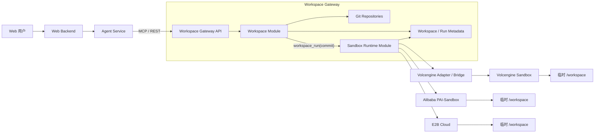
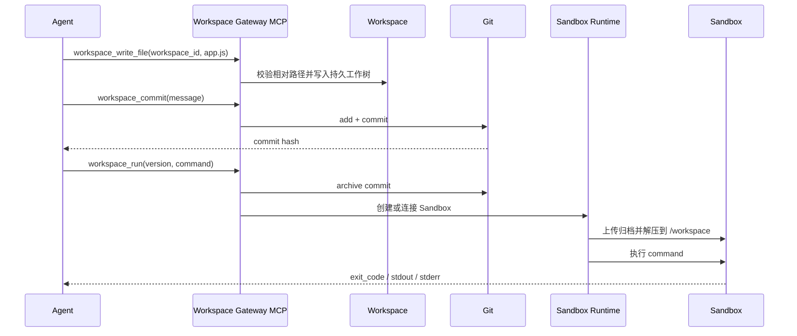

# Workspace Gateway 技术方案

## 1. 背景与目标

网页端 Coding Agent 需要一个长期、可版本化的项目工作区，同时需要把命令执行、依赖安装、构建测试和 Next.js 预览放在隔离环境中。不同云厂商的 Sandbox 在认证、模板、生命周期、文件 API、后台进程和端口暴露方式上存在差异，业务 Agent 不应直接依赖每一家 SDK。

本方案建设一个独立的 `workspace-gateway`：

- 对 Agent 优先提供 Workspace-first MCP 与 REST API；
- 持久化保存项目文件和 Git 版本，Workspace 是代码事实来源；
- 对下接入阿里云 PAI-Sandbox、海外 E2B Cloud 和火山引擎 Sandbox；
- 将 Workspace Code Plane 与 Sandbox Execution Plane 解耦；
- 统一实例映射、能力发现、错误、审计、限额和生命周期；
- Provider 密钥只保存在 Gateway，不进入 Agent 提示词和用户工作区。

当前代码是可运行的 MVP，不把尚未核实的火山引擎 OpenAPI 路径硬编码为“官方实现”。

## 2. 结论

推荐架构：

> Stateless Agent Service + Workspace Gateway（Persistent Git Workspace + Sandbox Runtime）+ Ephemeral Sandbox



业务层首先持有 Workspace ID 和 Git commit；运行时再持有 Gateway Sandbox ID，例如：

```text
sbxgw_7f91...
```

厂商实例 ID、区域、Endpoint 和认证凭据由 Gateway 管理。切换 Provider 不改变 Agent 的 Workspace 文件工具和运行工具协议。

项目源码持久化在独立 Workspace 中，并使用 Git commit hash 标识版本。运行时才把指定版本同步到临时 Sandbox；Sandbox 销毁不影响源码。详细方案见 [Workspace 持久化代码与 Sandbox 运行方案](workspace-architecture.md)。

## 3. 设计原则

### 3.1 控制面与执行面分离

Agent Service 负责 LLM、Agent Loop、会话、计划和权限决策。Workspace Gateway 负责持久化文件与 Git 版本，并通过内部 Sandbox Runtime 管理命令、进程和 Sandbox 生命周期。用户代码不在 Agent 服务本机执行。

### 3.2 能力驱动，而不是最低公共能力

统一核心能力，同时通过 `/v1/providers` 返回 Provider 能力。后续可扩展：

- Snapshot / Resume；
- 流式命令；
- PTY；
- 浏览器；
- GPU；
- 自定义镜像；
- 网络策略。

不支持的能力应明确返回，不用静默降级。

### 3.3 Gateway ID 与 Provider ID 分离

业务请求不接受裸 Provider Sandbox ID。映射表至少记录：

| 字段 | 说明 |
|---|---|
| `id` | Gateway ID |
| `provider` | `pai` / `e2b` / `volcengine` |
| `provider_sandbox_id` | 厂商实例 ID |
| `template_id` | 创建模板 |
| `state` | Gateway 归一化状态 |
| `created_at` / `updated_at` | 生命周期时间 |

生产版还应增加 `tenant_id`、`user_id`、`workspace_id`、`region`、`expires_at`、`version` 和审计字段。

### 3.4 Provider 配置由数据库管理

PAI、E2B 和火山引擎的连接配置由管理后台写入 `provider_configurations` 表，服务启动时从数据库恢复并构造 Provider Adapter。`.env` 只保存数据库 URL、Gateway 监听地址和 Gateway API Key 等部署配置。

Provider Token 不允许出现在：

- API 请求正文；
- Sandbox metadata；
- Agent 上下文；
- `/workspace` 文件；
- API 错误响应；
- 普通应用日志。

## 4. 三家 Provider 接入差异

| 维度 | PAI-Sandbox | E2B Cloud | 火山引擎 Sandbox |
|---|---|---|---|
| 当前适配方式 | E2B-compatible SDK + PAI Domain | E2B SDK 默认服务 | E2B-compatible 模式或独立 REST Bridge |
| 创建参数 | PAI Template ID、Domain、API Key | E2B Template、API Key | 取决于实际产品与区域 |
| 连接已有实例 | `Sandbox.connect` | `Sandbox.connect` | 由 Adapter 转换 |
| 文件/命令 | E2B Files / Commands | E2B Files / Commands | Bridge 统一为 Files / Commands |
| Preview | `get_host(port)`，网关流量可能另需实例 Token | `get_host(port)` | Provider URL 或 Bridge Proxy |
| Pause/Kill | 受 PAI 与 SDK 版本能力约束 | SDK 生命周期能力 | 转换厂商生命周期操作 |
| SDK 版本 | 当前 POC 使用 `e2b>=2.13,<2.25` 兼容 PAI | 与 PAI 共用受控版本 | 独立适配，避免版本耦合 |

### 4.1 阿里云 PAI-Sandbox

PAI 对外提供 E2B-compatible 接入。管理员在管理后台配置 E2B Domain、API Token 和默认超时，这些字段保存在数据库中，查询接口只返回是否已配置和非敏感 Endpoint。

Template ID 在独立模板目录中维护，不属于 Provider 连接配置。Gateway 调用 E2B Python SDK，可以连接 code-interpreter 模板，也可以连接自定义 Node.js / Next.js 模板。

PAI 需要特别处理 Preview 鉴权：端口 URL 与 SDK 控制面 API Key 不是同一个概念。生产版 Preview Proxy 应从当前连接对象或安全凭据服务获得实例级 Token，在 Gateway 内注入，不能把 Token 返回给浏览器。

### 4.2 E2B Cloud

E2B 使用默认服务域名，只需配置 API Key 与 Template。Gateway 内部接口与 PAI 基本一致，但模板命名、实例保留策略和 Preview 鉴权仍应分别配置，不要因为共用 SDK 就认为语义完全相同。

### 4.3 火山引擎 Sandbox

火山引擎接入保留两种模式：

1. `e2b`：只有在官方或账号实际 Endpoint 已验证兼容时使用；
2. `rest`：Gateway 调用一个内部 Bridge，Bridge 再调用火山引擎官方 SDK/OpenAPI。

这样做的原因是火山引擎的产品线、区域、签名与异步任务可能不同。核心 Gateway 不应该依赖未经验证的 Action 名称或在多个模块重复实现签名。

可选 Bridge Contract 已合并到[火山引擎云沙箱接入技术方案](volcengine-sandbox-integration-technical-solution.md)第 16 节。获得火山引擎账号对应的官方文档、区域和 API 示例后，只需实现 Bridge，Gateway API 无需变化。

## 5. 统一 API

### 5.0 管理控制台

Gateway 内置 `/console` 管理页面，直接调用统一 `/v1` API，不访问任何 Provider SDK。

页面展示：

- 使用中、运行中、暂停实例和已配置 Provider 数量；
- PAI、E2B、火山引擎的非敏感接入配置；
- 与 Provider 配置解耦的沙箱模板目录；
- Gateway ID、Provider ID、状态、模板、Workspace 和更新时间；
- 模板、超时、metadata、环境变量名称、创建时间和最后更新时间；
- 创建、刷新状态、暂停和销毁操作。

沙箱环境变量只保存并展示名称，不保存值。Provider Token 保存在专用 Provider 配置表中，但不返回浏览器、Agent 或普通读取 API。控制台的 Gateway API Key 只存放在当前标签页的 `sessionStorage`。

控制台是运维入口，不替代多租户权限系统。生产部署仍需在 Gateway 前增加 OIDC、RBAC、审计和 Workspace 所有权检查。

### 5.1 Provider 能力

```http
GET /v1/providers
```

返回每个 Provider 是否已配置，以及命令、文件、进程、预览、暂停和销毁能力。

Provider 只保存连接信息，不保存 Template ID。模板通过独立目录维护：

```http
GET    /v1/templates
POST   /v1/templates
DELETE /v1/templates/{template_catalog_id}
```

每个模板包含所属 Provider、厂商 Template ID、显示名称、说明和默认超时。

### 5.2 Sandbox 生命周期（管理与内部运行接口）

这些 REST 接口供管理后台和 Workspace Run Orchestrator 使用。Agent MCP 不发布 `sandbox_create` 或 `sandbox_list`，而是通过 `workspace_run` 使用后台默认模板创建运行环境。

```http
POST   /v1/sandboxes
GET    /v1/sandboxes
GET    /v1/sandboxes/{gateway_id}?refresh=true
POST   /v1/sandboxes/{gateway_id}/pause
DELETE /v1/sandboxes/{gateway_id}
```

创建请求：

```json
{
  "provider": "pai",
  "template_id": "optional-override",
  "timeout_seconds": 900,
  "env": {},
  "metadata": {"workspace_id": "ws_123"}
}
```

### 5.3 命令和后台进程

```http
POST /v1/sandboxes/{gateway_id}/commands
POST /v1/sandboxes/{gateway_id}/processes
```

同步命令返回 `exit_code`、`stdout` 和 `stderr`。后台进程返回 PID；部分 Provider 无法返回 PID 时允许为 `null`。

下一阶段增加：

```text
POST /commands:stream
WebSocket /commands/{command_id}/events
POST /commands/{command_id}/cancel
```

### 5.4 Sandbox 文件（内部运行接口）

```http
PUT /v1/sandboxes/{gateway_id}/files
GET /v1/sandboxes/{gateway_id}/files?path=/workspace/app.js
```

这些接口供 Workspace Run Orchestrator 上传确定 commit 的源码归档，以及受信任的运维流程使用，不向 Agent MCP 发布为源码编辑能力。文本可以直接使用 `text`；二进制内容使用 `content_base64`。路径统一限制在 `/workspace` 下。

大文件、目录同步和增量补丁不适合 JSON Base64，下一阶段应增加：

- Multipart 上传；
- tar/zip 批量同步；
- Apply Patch；
- 文件哈希和乐观锁；
- 对象存储预签名 URL。

### 5.5 Preview

```http
GET /v1/sandboxes/{gateway_id}/preview/{port}
POST /v1/sandboxes/{gateway_id}/preview/{port}/access
GET /v1/sandboxes/{gateway_id}/proxy/{port}/{path}
```

管理后台通过 `access` 接口获得 15 分钟的同源访问地址。Gateway 使用短期 Cookie 校验浏览器访问，从 SDK 连接对象取得实例级 Token，在向上游转发 HTTP 请求时注入 `X-Access-Token`，不会把 Provider Token 返回浏览器：

```text
Browser
  → Gateway Preview Authorization
  → Workspace / User permission check
  → Inject provider-specific token
  → Provider port URL
  → Sandbox :3000
```

当前 HTTP 页面和静态资源可以通过 Gateway 打开。后续仍需增加 WebSocket 转发，才能保证 Next.js HMR 正常工作；多实例部署时还需将短期预览会话迁移到 Redis 或使用可验证签名。

## 6. 内部模块

```text
src/workspace_gateway/
├── app.py                 FastAPI 路由、鉴权、错误映射
├── config.py              Gateway 部署环境配置
├── models.py              统一 API 模型
├── service.py             编排、路径限制、ID 映射
├── workspace_service.py   Git Workspace、提交、归档同步与运行
├── storage.py             PostgreSQL / SQLite 映射存储
├── registry.py            Provider 注册与能力发现
├── providers/
    ├── base.py            Provider Protocol
    ├── e2b_compatible.py  PAI / E2B / compatible endpoint
    └── volcengine.py      火山引擎 REST Bridge Adapter
└── web/
    ├── console.html       管理控制台结构
    ├── console.css        响应式设计与主题
    └── console.js         API 数据、筛选、详情和操作
```

Provider Adapter 只处理厂商差异，不能包含租户权限、计费或业务 Agent 逻辑。

## 7. Workspace 写入与运行流程

以 Agent 写入 `app.js`，提交并运行为例：



Agent 不直接写远程 Sandbox。代码首先保存在 Workspace 并形成可追踪的 Git commit；Sandbox 中只有该版本的临时运行副本，销毁 Sandbox 不影响项目源码。

## 8. 生命周期和状态

归一化状态：

```text
creating → running → paused → running
                └──────────→ terminated
任何状态 ────────────────→ error / unknown
```

状态并非强一致：SQL 数据库保存的是最后已知状态。使用 `refresh=true` 时才向 Provider 查询。生产版应增加：

- 后台 Reconciler；
- TTL 回收；
- 创建与销毁幂等键；
- Provider Webhook；
- 状态版本号；
- 失败补偿和孤儿实例扫描。

## 9. 用户代码如何保存

Sandbox 不是持久化来源。无论选择哪一家 Provider，Agent 的代码读写都必须先进入 Workspace。

### 当前方案：Git 仓库作为事实来源

```text
Agent → Workspace working tree → Git commit
                                  ↓ workspace_run
                           Sandbox /workspace
```

Sandbox 内的修改不自动回写。需要保留的源码必须通过 Workspace 工具重新写入并提交。Git 的版本、分支、审计和协作能力成熟；未提交改动、依赖缓存和大文件需要额外处理。

### 演进方案：文件服务/对象存储快照

```text
Workspace Snapshot → Object Storage
                  ↘ metadata / manifest → Database
```

适合自动保存未提交状态、快速恢复和非 Git 用户。需要处理增量同步、冲突、快照清理和加密。

### 推荐组合

- Git 保存可交付源码和历史；
- 对象存储保存未提交 Workspace 快照；
- 数据库保存 `workspace_id`、repo、branch、commit、snapshot 和 `gateway_id`；
- `node_modules` 与构建缓存按策略重建或使用独立缓存，不和源码快照混为一体。

## 10. 安全设计

### 10.1 Gateway

- 非本机部署必须设置 `GATEWAY_API_KEY`；生产版应换成 JWT/OIDC 和租户级 RBAC。
- Provider 凭据由数据库配置层读取；生产环境使用数据库加密并通过 KMS/Secret Manager 加密敏感列。
- 限制请求体、命令输出、超时、并发数和创建频率。
- 所有用户操作记录审计事件，但默认不记录源代码正文和命令环境变量。
- 错误响应需要脱敏；Provider 原始异常不得直接透传到公网。

### 10.2 Sandbox

- 非 root、最小能力、CPU/内存/磁盘/PID/TTL 限额；
- 默认限制出网，禁止云元数据地址和内部控制面；
- npm 安装脚本视为不可信代码；
- Git 与模型凭据使用短期 Token；
- 用户 A 的 Workspace 不得连接用户 B 的 Sandbox；
- Preview 需再次鉴权，不能仅依赖不可猜测 URL。

### 10.3 路径

Gateway 已限制文件路径和命令工作目录在 `/workspace`。Provider Bridge 必须重复校验，形成纵深防御。

## 11. 可观测性

建议统一指标：

- `sandbox_create_duration_seconds{provider}`
- `sandbox_operation_duration_seconds{provider,operation}`
- `sandbox_operation_errors_total{provider,operation,code}`
- `sandbox_active_total{provider,state}`
- `sandbox_command_timeout_total{provider}`
- `sandbox_preview_connections{provider}`
- `sandbox_orphan_total{provider}`

Trace 贯穿 Web Backend → Agent → Gateway → Provider，使用统一 `request_id`、`workspace_id` 和 `gateway_id`，Provider Token 不进入 Span Attribute。

## 12. 部署方案

### MVP

```text
1 个 Gateway 实例
PostgreSQL（SQLite 仅用于自动化测试）
Provider 配置表
PAI / E2B Provider Adapter
火山引擎 Bridge Adapter
```

适合本地开发和小规模验证。

### 生产

```text
Load Balancer
  → 多副本 Gateway
  → PostgreSQL
  → Redis（锁、短期状态、限流）
  → Secret Manager / KMS
  → Provider APIs
  → Reconciler / TTL Worker
```

Gateway 本身无用户代码状态，可水平扩展。当前本地部署使用 PostgreSQL；SQLite 仅用于自动化测试。

## 13. 演进路线

### 阶段 1：统一控制 API（当前）

- Gateway ID 和 PostgreSQL / SQLite 映射；
- PAI/E2B E2B SDK Adapter；
- 火山引擎 E2B/Bridge 两种入口；
- 创建、命令、进程、文件、预览 URL、暂停、销毁；
- 离线 Fake Provider 测试。

### 阶段 2：可用于网页 Coding Agent

- 流式命令输出和取消；
- WebSocket Preview Proxy 与多实例会话存储；
- Workspace 归属鉴权；
- Git clone/push 与对象存储快照；
- TTL Worker 和孤儿清理；
- PAI、E2B 真实集成测试。

### 阶段 3：多租户生产化

- PostgreSQL、Redis 锁和幂等；
- OIDC、RBAC、配额、计费与审计；
- 网络出口代理和域名策略；
- Provider 选路、区域容灾和成本策略；
- 火山引擎官方 API Bridge 完整落地；
- OpenTelemetry、SLO 和告警。

## 14. Provider 选路建议

第一版由请求显式指定 `provider`。生产版可增加策略引擎：

```text
用户区域
  + 数据合规
  + 模板/运行时能力
  + 当前容量
  + 冷启动延迟
  + 单位成本
  + Provider 健康度
  → provider + region + template
```

建议：

- 中国大陆用户优先 PAI 或满足合规要求的国内 Provider；
- 海外用户优先 E2B；
- 火山引擎在对应区域、模板和官方 API 验证后加入自动选路；
- 首期不要做跨 Provider 热迁移，先通过 Git/快照实现冷恢复。

## 15. 开始真实联调前需要的信息

### PAI

- E2B Domain；
- workspace-level API Key；
- Template ID；
- 区域；
- Preview 实例 Token 的获取方式。

### E2B

- API Key；
- Template ID；
- 实例 TTL 与并发配额。

### 火山引擎

- 已开通的具体 Sandbox 产品名称；
- 官方文档链接和 API 版本；
- Region / Endpoint；
- 认证方式；
- 创建、连接、命令、文件、预览、暂停和销毁的官方请求示例；
- 是否原生兼容 E2B SDK。

不要把真实密钥写进文档、`.env` 或 Git；通过管理后台写入 Provider 配置表。生产环境应使用 KMS/Secret Manager 加密数据库中的敏感字段。

## 16. 参考入口

- [阿里云 PAI-Sandbox：通过 E2B SDK 访问](https://www.alibabacloud.com/help/zh/pai/e2b-sdk-access)
- [E2B Documentation](https://e2b.dev/docs)
- [火山引擎文档中心](https://www.volcengine.com/docs)

本次环境无法成功连接外部官方文档服务，因此火山引擎部分明确保留为 Adapter/Bridge 边界，未声称未经在线核验的 API 路径是官方接口。真实联调前必须用账号对应的官方文档完成确认。
