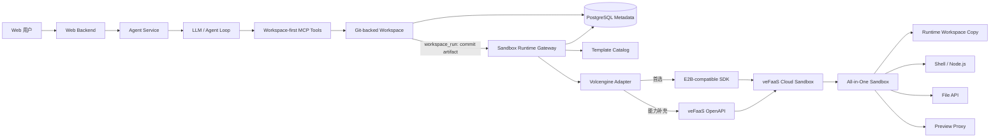
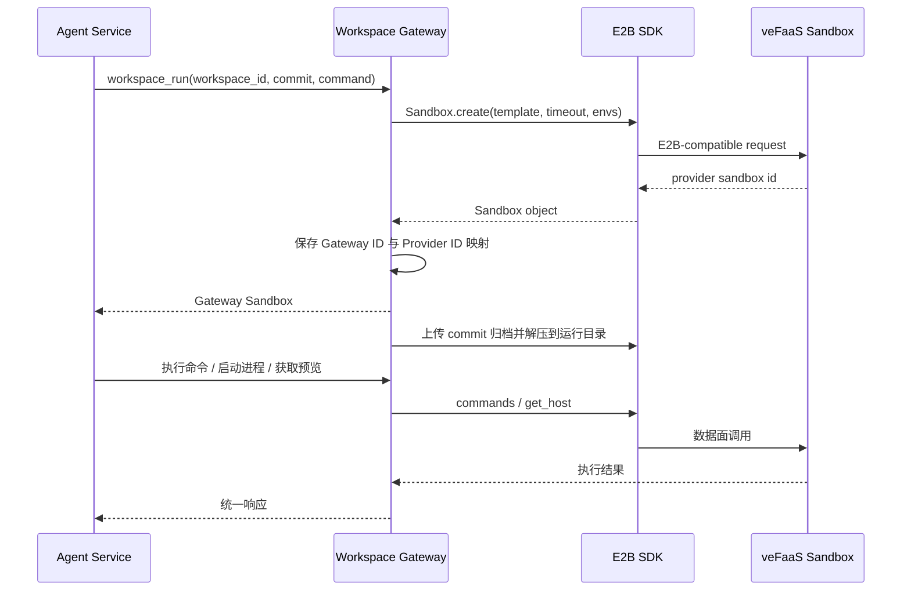
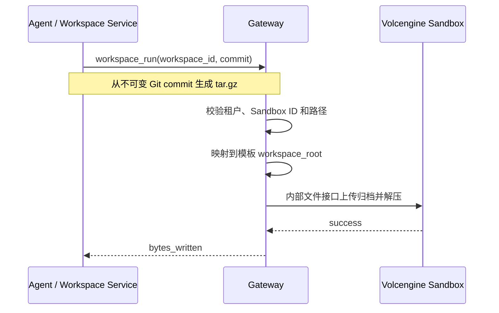

# 火山引擎云沙箱接入技术方案

> 文档状态：方案设计  
> 调研日期：2026-08-19  
> 适用项目：`workspace-gateway`

> 当前架构边界：项目已经采用 **Workspace-first** 模式。Agent 的源码读取、写入和版本管理只发生在持久化 Workspace；火山沙箱只保存某个 Git commit 的临时运行副本。本文中的文件接口是 Provider Adapter 和 `workspace_run` 编排层的内部能力，不应作为 Agent 的源码编辑接口发布。

## 1. 结论

火山引擎已经提供可以用于 Coding Agent 的正式云沙箱能力，可以接入当前 `workspace-gateway`。

本项目推荐采用两层接入策略：

1. **主路径：veFaaS 云沙箱 E2B 兼容协议**。复用项目现有的 E2B SDK 适配器，以最低改造成本获得创建、连接、命令、文件、后台进程、预览和销毁能力。
2. **兜底路径：veFaaS 原生 OpenAPI + All-in-One Sandbox 数据面 API**。用于补齐 E2B 兼容层没有暴露的暂停、恢复、快照、实例规格、TOS/NAS 挂载和精细生命周期管理能力。

不再把项目当前的自定义 REST Bridge 作为默认方案。只有当企业网络、审计或凭据隔离要求必须增加内部代理时，才保留 Bridge。

本方案只采用“独立 Agent Backend + 远程执行沙箱”架构。Agent Loop、模型调用、会话和权限决策全部运行在 Agent Backend；沙箱只承担文件、命令、进程和端口预览，不在沙箱内安装或运行 Claude Code、OpenCode 或其他 Agent Runtime。

官方参考：

- [沙箱应用对接 E2B 协议](https://www.volcengine.com/docs/6662/2548872)
- [一键部署 All-in-One Sandbox 应用](https://www.volcengine.com/docs/6662/1851199)
- [veFaaS OpenAPI 列表](https://api.volcengine.com/api-docs/?serviceCode=vefaas&version=2024-06-06)
- [AIO Sandbox 文件操作](https://sandbox.agent-infra.com/guide/basic/file)
- [AIO Sandbox Shell](https://sandbox.agent-infra.com/guide/basic/shell)
- [AIO Sandbox Preview Proxy](https://sandbox.agent-infra.com/guide/basic/proxy)

## 2. 建设目标

接入完成后，业务 Agent 不感知火山引擎 SDK 和认证细节，只通过统一 MCP/Gateway API 完成：

- 在持久化 Workspace 中读写代码并提交 Git 版本；
- 通过 `workspace_run` 创建或连接沙箱，并同步指定版本；
- 执行 Shell、Node.js、Python、安装依赖和运行测试；
- 启动 Next.js 等后台服务；
- 通过 Gateway 安全访问沙箱内的 3000 等端口；
- 查询、暂停、恢复和销毁实例；
- 在管理页面查看运行中沙箱、资源规格、模板、创建时间和过期时间；
- 将 Provider 连接配置与沙箱模板配置分开管理；
- 支持 Git、TOS、NAS 或快照等工作区保存策略。

### 2.1 明确不在本方案范围内的能力

- 不在沙箱中运行 Claude Code、OpenCode 或自研 Agent Loop；
- 不允许 Agent Backend 使用本机 Python、Shell 或文件系统处理用户代码；
- 不把 Provider SDK、Provider 凭据或裸 Provider Sandbox ID 直接暴露给模型；
- 不允许模型绕过 Gateway 直接连接 PAI、E2B 或火山引擎；
- 不把 MCP 当作安全边界，MCP 只是一种远程工具调用协议。

本方案唯一允许的执行路径是：

```text
用户指令
  → Agent Backend 的模型与 Agent Loop
  → Workspace MCP Tool（读取、写入、提交）
  → Git-backed Workspace
  → workspace_run（把确定的 commit 同步到临时运行环境）
  → Gateway Sandbox Runtime Tool
  → Provider Adapter
  → 用户绑定的远程 Sandbox
  → Python/Shell/Node.js 在 Sandbox 内执行
```

## 3. veFaaS 云沙箱能力判断

veFaaS 提供沙箱应用、沙箱实例、沙箱镜像、预热池、暂停/恢复、快照以及 E2B API Key 管理。原生控制面已经提供：

- `CreateSandbox`
- `DescribeSandbox`
- `ListSandboxes`
- `SetSandboxTimeout`
- `PauseSandbox`
- `ResumeSandbox`
- `KillSandbox`
- `CreateSandboxSnapshot`
- `CreateE2BAPIKey`
- `ListE2BAPIKeys`

其中 `CreateSandbox` 支持 Function ID、实例镜像、CPU、内存、环境变量、metadata 和存储挂载等配置。[CreateSandbox API](https://api.volcengine.com/api-docs/view?action=CreateSandbox&serviceCode=vefaas&version=2024-06-06)

All-in-One Sandbox 数据面包含：

- Shell、Bash Pipe 和 WebSocket Terminal；
- 文本和二进制文件读写、上传、下载、搜索和文件监听；
- Python、Node.js 和 Jupyter；
- Browser、VNC 和 VS Code Server；
- MCP；
- 前端和后端端口代理；
- 可选的开发工具和浏览器环境。

这套能力与网页端 Coding Agent 的工作区需求匹配。

## 4. 总体架构



Agent Backend 只允许通过 Workspace-first MCP Tools 调用 Gateway。源码编辑使用 Workspace 工具；命令、进程和预览使用 Sandbox Runtime 工具。它不能注册指向 Gateway 本机的 Bash、Python、文件写入或 `subprocess` 工具。

控制面与数据面分开：

- **控制面**：创建、状态、TTL、暂停、恢复、销毁、快照和实例列表。
- **数据面**：Workspace 版本归档的内部上传、命令执行、进程、日志、Terminal 和端口预览。

业务系统只保存 Gateway Sandbox ID，不直接使用火山的 Sandbox ID。

## 5. 两种接入模式

### 5.1 模式 A：E2B 兼容协议

这是默认模式。



#### Provider 配置

Provider 只配置连接信息，并由管理后台写入数据库：接入模式 `e2b`、E2B Domain、API Key 和默认超时。

不在 Provider 中配置 Template ID。

#### Template 配置

模板目录单独保存：

| 字段 | 说明 |
|---|---|
| `provider` | 固定为 `volcengine` |
| `template_id` | 火山 E2B 协议要求的模板标识；以控制台实际值为准 |
| `name` | 管理页面显示名称 |
| `description` | 镜像、运行时和用途说明 |
| `default_timeout_seconds` | 默认生命周期 |
| `workspace_root` | 例如 `/home/gem/workspace` |
| `region` | 例如 `cn-beijing` |

火山 E2B 文档较新，`template` 参数究竟使用沙箱应用 ID、Function ID 还是单独的 E2B 模板标识，必须通过账号侧控制台示例和最小连通测试确认，不能在代码里猜测。

### 5.2 模式 B：veFaaS 原生接口

当 E2B 兼容层缺少某项能力时，Gateway 直接使用 veFaaS OpenAPI 管理实例，并调用 AIO Sandbox HTTP API 操作工作区。

原生模式的 Provider 配置同样由管理后台写入数据库，包括接入模式、最小权限临时 AK/SK、Region 和默认超时。长期主账号凭据不得保存。

Template 配置除 Function ID 外，还需要保存应用的数据面访问地址：

```json
{
  "provider": "volcengine",
  "template_id": "<veFaaS Function ID>",
  "name": "Volcengine AIO Node.js",
  "workspace_root": "/home/gem/workspace",
  "provider_options": {
    "function_route": "https://example.apigateway-cn-beijing.volceapi.com",
    "region": "cn-beijing"
  }
}
```

AK/SK 属于 Provider 凭据；Function ID、应用访问地址和工作区路径属于 Template，不应混在 Provider 配置中。

## 6. Gateway 能力映射

| Gateway 能力 | E2B 模式 | 原生 veFaaS/AIO 模式 |
|---|---|---|
| 创建 | `Sandbox.create` | `CreateSandbox` |
| 连接 | `Sandbox.connect` | `DescribeSandbox` + 数据面 URL |
| 查询状态 | `is_running` | `DescribeSandbox` / `ListSandboxes` |
| 同步命令 | `commands.run` | `/v1/bash/*` 或 `/v1/shell/exec` |
| 后台进程 | `commands.run(background=True)` | Shell `async_mode` / Bash Pipe |
| 写文件 | `files.write` | `/v1/file/write` |
| 读文件 | `files.read` | `/v1/file/read` |
| 上传/下载 | SDK Files | `/v1/file/upload`、`/v1/file/download` |
| Preview | `get_host(port)` | 子域名、`x-aio-proxy-port` 或 `/absproxy/{port}/` |
| 设置 TTL | SDK timeout | `SetSandboxTimeout` |
| 暂停 | SDK `pause`，需实测 | `PauseSandbox` |
| 恢复 | 取决于 SDK 兼容范围 | `ResumeSandbox` |
| 销毁 | `kill` | `KillSandbox` |
| 快照 | 取决于 SDK 兼容范围 | `CreateSandboxSnapshot` |

## 7. 关键流程

### 7.1 创建沙箱

1. 管理员在 Template Catalog 中配置并选定 MCP 默认火山模板。
2. Agent 调用 `workspace_run`，Gateway 读取默认 Template 和 Provider 连接配置。
3. Gateway 调用 E2B `Sandbox.create`；失败且错误属于明确的不兼容能力时，才进入原生适配路径。
4. Gateway 生成自己的 `sbxgw_*` ID。
5. PostgreSQL 保存 Gateway ID、火山 Sandbox ID、Template ID、状态、过期时间和 metadata。
6. 返回 Gateway Sandbox，不向业务层返回 Provider 密钥。

不建议对所有错误自动降级到另一条路径。认证失败、额度不足和参数错误必须直接返回，避免重复创建或产生额外费用。

### 7.2 将 Workspace 版本同步到沙箱（Gateway 内部）



路径策略：

- Agent MCP 不发布 `sandbox_write_file` 和 `sandbox_read_file`；源码必须通过 Workspace 工具管理；
- Gateway 对外继续使用统一 `/workspace`；
- Adapter 把 `/workspace/...` 映射到模板配置的真实路径，例如 `/home/gem/workspace/...`；
- 规范化路径后必须再次检查不能逃逸工作区；
- 禁止通过 `..`、符号链接或编码绕过访问其他租户目录；
- 二进制内容通过 Base64 或 multipart 传输。

### 7.3 执行命令

Gateway 接口保持：

```http
POST /v1/sandboxes/{gateway_id}/commands
```

```json
{
  "command": "npm test",
  "cwd": "/workspace",
  "timeout_seconds": 60,
  "env": {}
}
```

Adapter 将 `cwd` 映射到真实工作区后调用 E2B Commands 或 AIO Bash API，统一返回：

```json
{
  "exit_code": 0,
  "stdout": "...",
  "stderr": ""
}
```

长时间运行的 Next.js 服务必须使用后台进程接口，不能占用同步 HTTP 请求。

### 7.4 Next.js 端口预览

沙箱内启动服务：

```bash
npm run dev -- --hostname 0.0.0.0 --port 3000
```

E2B 模式优先使用 `sandbox.get_host(3000)`。

原生 AIO 模式可使用：

- `${port}-${domain}` 子域名；
- `/absproxy/3000/` 前端绝对路径代理；
- 由可信 Gateway 注入 `x-aio-proxy-port: 3000`。

如果 veFaaS 沙箱应用使用统一域名，还需要通过 `x-faas-instance-name` 指定沙箱实例。

推荐浏览器只访问 Gateway：

```text
/v1/sandboxes/{gateway_id}/preview/3000/{path}
```

Gateway 内部添加实例选择和端口选择头。`x-aio-proxy-port` 不能直接接受浏览器传入值，必须由 Gateway 根据已校验的路由参数覆盖，防止任意探测沙箱内部端口。

## 8. Provider 与 Template 分离

### Provider 保存

- E2B API Key 或 veFaaS AK/SK；
- E2B Domain；
- Region；
- 默认连接超时；
- 接入模式。

### Template 保存

- Function ID 或 E2B template 标识；
- 沙箱应用访问地址；
- 镜像/运行时说明；
- 工作区根目录；
- 默认生命周期；
- CPU、内存等展示信息；
- 是否支持 Browser、VS Code 和端口预览；
- 持久化策略。

建议为 `sandbox_templates` 增加：

```text
workspace_root       VARCHAR(512)
region               VARCHAR(64)
provider_options     JSON
capabilities         JSON
```

密钥不能写入 `provider_options`。

## 9. 工作区保存策略

沙箱默认是临时环境，不能把实例本地磁盘当作用户代码的唯一副本。

推荐分层保存：

1. **Git 仓库作为代码主存储**：创建时 clone，重要阶段 commit/push，适合源码、配置和审计。
2. **TOS/NAS 作为工作目录或大文件存储**：适合依赖缓存、构建产物、用户上传文件和未提交草稿。
3. **Sandbox Snapshot 用于快速恢复环境**：适合保存已经安装依赖的开发环境，但不替代 Git。
4. **Gateway PostgreSQL 只保存元数据**：不能保存完整源码和二进制文件。

建议 MVP 使用 Git；第二阶段增加 TOS 挂载和快照。

## 10. 状态和生命周期映射

| 火山状态 | Gateway 状态 |
|---|---|
| `Pending` / `Starting` | `creating` |
| `Ready` | `running` |
| 冻结或暂停 | `paused` |
| `Terminating` | `terminated` 或保持上一次状态直到确认 |
| `Failed` | `error` |
| 查询不到 | `unknown`，经过回收确认后转 `terminated` |

Gateway 应运行周期性 Reconciler：

- 刷新运行实例状态；
- 同步 `ExpireAt`；
- 标记已被 Provider 自动回收的实例；
- 发现 Gateway 数据库没有记录的孤儿实例时先告警，不立即删除；
- 对即将过期但仍有活动会话的实例按策略续期。

原生 `SetSandboxTimeout` 的范围和 E2B `timeout` 语义可能不同，Adapter 必须按 Provider 限制校验，不能只依赖 Gateway 当前的通用上限。

## 11. 安全设计

### 11.1 凭据

- 优先使用 E2B API Key，避免业务路径持有主账号 AK/SK；
- 原生模式使用最小权限 IAM 子账号或临时凭据；
- 密钥保存在 Gateway 的 Provider 配置表；生产环境使用数据库加密和 KMS/Secret Manager 保护敏感字段；
- API、日志、metadata、Agent Prompt 和工作区均不能出现密钥；
- 管理页面只能显示“已配置”，不能回显密钥。

### 11.2 多租户

- 所有 Gateway Sandbox 记录必须包含 `tenant_id`、`user_id`、`workspace_id`；
- 操作前校验 Sandbox 所有权；
- 不允许业务调用方传入裸 Provider Sandbox ID；
- 文件路径限制在所属工作区；
- Preview URL 使用短期签名并绑定用户、Sandbox、端口和过期时间。

### 11.3 命令与网络

- 沙箱承担不可信代码的隔离边界，但 Gateway 仍要控制配额、超时和并发；
- 对公网出口、VPC、内网地址和云元数据服务建立默认拒绝策略；
- 用户可控环境变量需要大小、数量和名称限制；
- 命令日志记录请求 ID、退出码、耗时和输出大小，不默认记录完整源码；
- 对输出设置最大字节数，超出后截断并提供日志游标。

## 12. 管理页面改造

火山 Provider 配置页面调整为：

### E2B 模式

- E2B Domain
- E2B API Key
- Region
- 默认超时
- “测试连接”按钮

### 原生模式

- Access Key ID
- Secret Access Key
- Region
- 默认超时
- “测试连接”按钮

模板继续在 Templates 菜单独立维护，不在 Provider 弹窗中填写 Template ID。

沙箱详情页增加：

- 火山 Sandbox ID；
- Function ID / Template；
- Region / 可用区；
- CPU / 内存；
- 创建时间 / 过期时间；
- Workspace Root；
- Preview 端口；
- 暂停、恢复、销毁；
- 最后一次 Provider 同步时间和错误。

## 13. 代码改造计划

### 第一阶段：E2B POC

1. 将火山 Provider 默认模式改为 `e2b`。
2. 复用 `E2BCompatibleProvider`。
3. 更新 Provider 配置文案，移除默认 Bridge 描述。
4. 增加火山模板及 `workspace_root` 支持。
5. 完成真实账号连通性测试。

### 第二阶段：生产化 E2B 接入

1. 增加 SDK 兼容版本测试矩阵。
2. 增加 Provider 连接检查和错误分类。
3. 完善 Preview Proxy 和短期鉴权。
4. 增加状态 Reconciler、TTL 和孤儿实例告警。
5. 增加审计、租户隔离、并发和成本配额。

### 第三阶段：原生 veFaaS 能力

1. 新增 `VolcengineVefaasProvider`。
2. 对接 Create/Describe/List/Pause/Resume/Kill/SetTimeout。
3. 对接 AIO Shell、File 和 Preview API。
4. 支持 TOS/NAS 挂载、快照和预热池。
5. 将当前自定义 Bridge 降级为可选企业部署组件。

## 14. 最小验收用例

必须使用真实火山账号完成以下测试：

1. 用模板创建一个 Sandbox，取得 Provider Sandbox ID。
2. 通过 Workspace MCP 写入并提交 `hello.js`，再用 `workspace_run` 同步该 commit。
3. 执行 `node /workspace/hello.js`，正确获得 stdout 和退出码，并记录来源 commit。
4. 创建一个包含中文和二进制内容的文件，验证编码正确。
5. 后台启动 Next.js 3000 端口。
6. 通过 Gateway Preview Proxy 访问页面和静态资源。
7. 查询状态和过期时间。
8. 暂停后确认命令不可执行，恢复后工作区仍然存在。
9. 销毁后无法再次连接。
10. 验证错误响应和日志中没有 E2B Key、AK、SK。
11. 验证用户 A 不能访问用户 B 的 Sandbox、文件和 Preview。
12. 验证沙箱到期后的代码恢复策略。

## 15. 实施所需账号信息

优先 E2B 模式只需要：

- 火山 veFaaS E2B Domain；
- 临时 E2B API Key；
- Region；
- 沙箱应用对应的 E2B template 标识；
- 一个已部署的 All-in-One Sandbox 应用。

如果改用原生模式，还需要：

- 最小权限 Access Key ID；
- Secret Access Key；
- veFaaS Function ID；
- API Gateway 访问地址；
- 应用使用统一域名还是泛域名；
- 沙箱应用的鉴权方式和网络配置。

不要提供主账号长期 AK/SK。测试应使用可撤销的临时凭据或最小权限子账号。

## 16. 可选企业 Bridge Contract

### 16.1 使用条件与职责

火山引擎具体 Sandbox 产品、区域、认证方式和 OpenAPI 版本需要根据账号实际开通情况确认。在没有确认官方 API 前，Gateway 不应该猜测 Action、Path 或签名参数。

如果账号已经提供并验证了 E2B-compatible Endpoint，直接使用第 5.1 节的 E2B 模式，不需要部署 Bridge。只有企业网络、统一审计、凭据隔离或兼容性补齐明确要求增加内部代理时，才启用 `VolcengineRestProvider` 和版本化 Bridge Contract。

Bridge 负责：

1. 接收 Workspace Gateway 的统一 REST 请求；
2. 使用火山引擎官方 SDK、OpenAPI 或账号要求的签名算法；
3. 将火山引擎的异步任务、错误码和字段转换为统一响应；
4. 只在 Bridge 内保存火山引擎 Access Key；
5. 不向 Workspace Gateway、Agent 或业务调用方返回长期凭据。

```text
Agent → Workspace MCP → Workspace/Git
                              ↓ workspace_run
                       Workspace Gateway
                              ↓ Bridge Contract
                       Enterprise Bridge
                              ↓ official SDK/OpenAPI
                       Volcengine Sandbox
```

Template ID 不属于 Provider 连接配置。Provider 中只配置 Bridge Endpoint 和 Bridge API Key；Function ID、Template ID、工作区根目录等继续在独立模板目录维护。

### 16.2 Gateway 调用 Bridge 的认证

```http
Authorization: Bearer <bridge-api-key>
Content-Type: application/json
```

Bridge 调用火山引擎时使用火山引擎要求的认证方式。Bridge API Key 与火山引擎 AK/SK 不得混用，任何长期凭据都不得进入 Workspace、Sandbox metadata、Agent Prompt 或 API 响应。

### 16.3 创建 Sandbox

```http
POST /v1/sandboxes
```

```json
{
  "template_id": "node-next-v1",
  "timeout_seconds": 900,
  "env": {},
  "metadata": {"workspace_id": "ws_123"}
}
```

响应：

```json
{
  "sandbox_id": "provider-sandbox-id",
  "state": "running"
}
```

### 16.4 查询状态

```http
GET /v1/sandboxes/{sandbox_id}
```

响应状态统一为：`creating`、`running`、`paused`、`terminated`、`unknown` 或 `error`。

### 16.5 执行同步命令

```http
POST /v1/sandboxes/{sandbox_id}/commands
```

```json
{
  "command": "npm test",
  "cwd": "/workspace",
  "timeout_seconds": 60,
  "env": {}
}
```

响应：

```json
{
  "exit_code": 0,
  "stdout": "...",
  "stderr": ""
}
```

### 16.6 启动后台进程

```http
POST /v1/sandboxes/{sandbox_id}/processes
```

请求字段为 `command`、`cwd` 和 `env`。响应字段为 `pid`；Provider 无法提供 PID 时允许返回 `null`。

### 16.7 内部文件接口

该接口只供 `workspace_run` 将确定的 Workspace commit 同步到沙箱，或者供受信任的运维流程使用，不向 Agent MCP 发布为源码编辑工具。

写入：

```http
PUT /v1/sandboxes/{sandbox_id}/files
```

```json
{
  "path": "/workspace/app.js",
  "content_base64": "Y29uc29sZS5sb2coNDIp"
}
```

读取：

```http
GET /v1/sandboxes/{sandbox_id}/files?path=/workspace/app.js
```

```json
{
  "content_base64": "Y29uc29sZS5sb2coNDIp"
}
```

### 16.8 Preview

```http
GET /v1/sandboxes/{sandbox_id}/preview?port=3000
```

```json
{
  "url": "https://provider-preview.example"
}
```

Provider Preview URL 只在 Gateway 内部使用。浏览器应通过 Gateway Preview Proxy 和短期访问会话打开页面，不能直接拿到 Bridge 凭据或 Provider Token。

### 16.9 暂停与销毁

```http
POST /v1/sandboxes/{sandbox_id}/pause
DELETE /v1/sandboxes/{sandbox_id}
```

成功时可以返回空 JSON 对象。创建、暂停和销毁必须支持幂等键，避免网络重试造成重复实例或错误状态。

### 16.10 Bridge 实现要求

- 所有操作必须设置超时；
- 火山引擎异步任务需要有上限地轮询，不能无限等待；
- Provider 原始错误只能写入受控、脱敏的服务端日志；
- 返回 Gateway 的错误必须移除 Token、AK/SK、签名和内部网络信息；
- 文件路径必须限制在 `/workspace`，Bridge 需要独立校验，不能只信任 Gateway；
- Preview URL 必须使用 HTTPS，并验证 Host 属于允许的火山引擎域名；
- 记录 `workspace_id`、`sandbox_id`、请求 ID、操作类型、耗时和结果；
- 不记录源码正文、文件内容、用户环境变量值或密钥；
- 对命令输出、文件大小、请求体、并发和生命周期设置上限；
- Bridge Contract 必须带版本并提供向后兼容策略。

## 17. 最终推荐

第一步直接验证 veFaaS 的 E2B 协议。当前项目已经具备 Workspace 版本同步、通用 E2B 文件、命令和 Preview 抽象，这条路线实现快、侵入小，也继续满足 Workspace/Sandbox、Provider/Template 两组边界分离的架构要求。

在 E2B POC 成功后，再按实际缺口补充原生 veFaaS 控制面。这样可以避免同时维护两套完整实现，也不会因为 E2B 兼容层暂时缺少暂停、快照或存储配置而限制后续能力。
