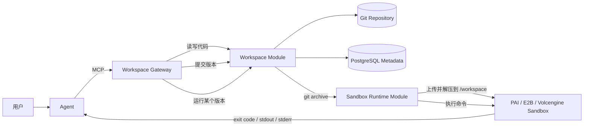
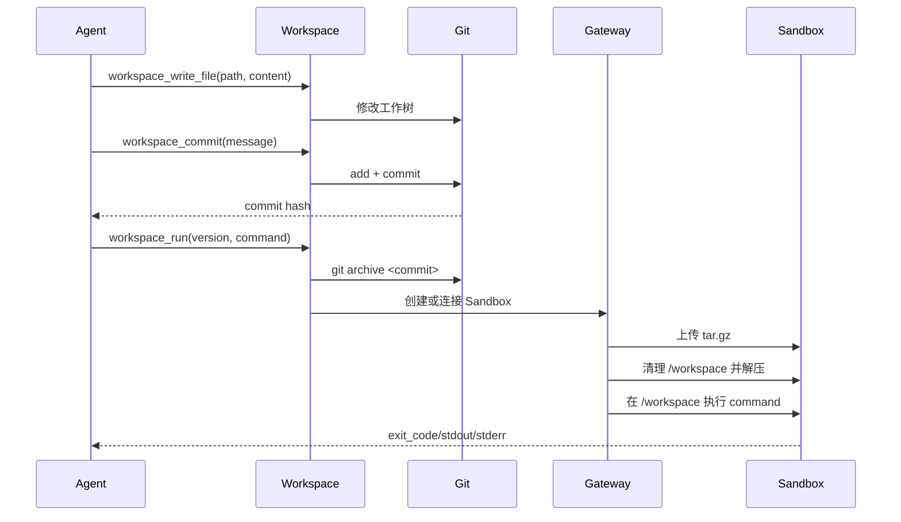

# Workspace 持久化代码与 Sandbox 运行方案

## 1. 目标与结论

Coding Agent 编写的项目代码不应只存在于 Sandbox。Sandbox 是可暂停、超时和销毁的临时执行资源；Workspace 才是项目代码的持久化来源。

当前系统采用：

> Git-backed Workspace（代码资产层） + Ephemeral Sandbox（执行层）



核心规则：

- Agent 的文件读写默认发生在持久化 Workspace，而不是临时 Sandbox；
- 每次提交生成不可变 Git commit hash，作为可审计、可重放的版本号；
- 运行前由 Gateway 从指定 commit 生成归档，再同步到 Sandbox 的 `/workspace`；
- Sandbox 被销毁不会删除 Workspace 代码和提交历史；
- Sandbox 中安装的依赖、构建产物和运行时临时文件默认不回写 Workspace。

## 2. 为什么 Workspace 必须独立

如果把 Sandbox 的 `/workspace` 当作唯一代码存储，会产生以下问题：

1. Sandbox 超时或销毁后代码丢失；
2. 多次运行没有明确的源码版本，无法复现问题；
3. Agent、用户和 CI 同时编辑时无法判断覆盖关系；
4. 无法对一次上线或运行追溯到准确代码；
5. 为了保留代码被迫长期保活 Sandbox，成本和安全风险都会增加。

独立 Workspace 后，生命周期变为：

```text
Workspace：长生命周期、持久化、版本化
Sandbox：短生命周期、隔离执行、可以随时销毁
```

## 3. 当前实现

### 3.1 存储模型

每个 Workspace 在 `GATEWAY_WORKSPACE_STORAGE_PATH` 下对应一个真实 Git 仓库：

```text
data/workspaces/
└── ws_<uuid>/
    ├── .git/
    ├── package.json
    ├── src/
    └── ...
```

PostgreSQL 中的 `workspaces` 表保存项目名称、说明、默认分支和时间；Git 仓库保存代码内容与提交历史。`workspace_runs` 表记录 Workspace 版本、Sandbox、命令和执行结果。SQLite 仅用于自动化测试。

代码内容不重复写入数据库，避免大文本、二进制文件和版本差异占用业务表。

### 3.2 文件能力

```http
POST /v1/workspaces
GET  /v1/workspaces
GET  /v1/workspaces/{workspace_id}
GET  /v1/workspaces/{workspace_id}/files
GET  /v1/workspaces/{workspace_id}/file?path=src/app.js
PUT  /v1/workspaces/{workspace_id}/file
```

支持文本和 Base64 二进制写入。所有路径必须是相对路径，禁止 `..`、绝对路径和访问 `.git`。当前单文件上限为 10 MB。

### 3.3 版本能力

```http
POST /v1/workspaces/{workspace_id}/commits
GET  /v1/workspaces/{workspace_id}/versions
GET  /v1/workspaces/{workspace_id}/file?path=...&version=<commit>
```

首次创建 Workspace 会生成一个空的初始化提交。后续写入修改工作树，提交时执行等价于：

```text
git add --all
git commit -m <message>
```

API 返回完整 commit hash。读取历史文件或运行固定版本时，只接受系统返回的 commit hash，不允许把任意 Git 参数传入命令。

### 3.4 同步与运行能力

```http
POST /v1/workspaces/{workspace_id}/sync
POST /v1/workspaces/{workspace_id}/runs
```

`sync` 用于把指定版本同步到一个已有 Sandbox。`runs` 支持两种方式：

- 未传 `sandbox_id`：使用管理后台配置的默认模板创建新 Sandbox；
- 传入 `sandbox_id`：复用已有 Sandbox。

运行请求默认 `auto_commit=true`，会先把未提交修改保存成 `Run snapshot` 版本，也可以关闭自动提交并明确传入历史版本。

## 4. 完整运行流程



同步的是已提交源码快照，不包含 `.git`，也不暴露 Gateway 主机文件路径。Sandbox 内只拿到运行所需代码。

## 5. MCP Agent 推荐流程

新增 Workspace MCP 工具：

| 工具 | 用途 |
|---|---|
| `workspace_create` | 创建持久化项目 |
| `workspace_get` | 查看当前版本、dirty 状态和文件数 |
| `workspace_list_files` | 查看项目文件 |
| `workspace_read_file` | 读取当前或历史版本文件 |
| `workspace_write_file` | 写入工作树 |
| `workspace_commit` | 提交并获得版本号 |
| `workspace_history` | 查看提交历史 |
| `workspace_run` | 提交、同步到 Sandbox 并运行 |

Agent 的首选调用链：

```text
workspace_create
  → workspace_write_file（多次）
  → workspace_commit
  → workspace_run
  → sandbox_start_process / sandbox_get_preview（需要 Web 预览时）
  → sandbox_kill
```

MCP 不再向 Agent 提供 `sandbox_write_file`、`sandbox_read_file` 或 `sandbox_create`。Sandbox 底层文件接口只供 Workspace Run Orchestrator 上传版本归档，以及受信任的 REST 运维流程使用。

## 6. 一致性与安全边界

- Workspace ID 与 Sandbox ID 分开管理；一个 Workspace 可以运行在多个 Sandbox；
- 每次运行记录准确的 Workspace commit hash，不用模糊的“最新代码”；
- 同步前清理 Sandbox 的 `/workspace` 顶层内容，避免旧版本残留文件影响结果；
- Git 命令使用参数数组调用，不拼接 Shell 字符串；
- 上传归档最大 100 MB，防止超大项目压垮 Gateway；
- Provider Token 不写入 Workspace、Git 历史或 Sandbox metadata；
- 当前版本尚未实现租户所有权，公网多用户部署前必须增加 `tenant_id/user_id`、RBAC、配额和审计。

## 7. 代码保存方案与演进

### 阶段一：当前实现——Gateway 本地 Git 仓库

适合单机 POC 和内部测试。实现简单、版本能力完整、无需额外基础设施。必须对 `data/workspaces` 做持久卷挂载和备份。

### 阶段二：共享文件服务 + Git 仓库

Gateway 多副本部署时，将 Workspace 根目录放到 NAS/NFS 等共享文件服务。需要增加 Workspace 级分布式锁，避免两个 Gateway 同时提交同一仓库。

### 阶段三：独立 Workspace/Git Service

生产多租户推荐拆分为独立服务：

```text
Agent → Workspace API → Git Service / Object Storage
                         ↓ immutable source artifact
                      Workspace Gateway → Sandbox
```

Git Service 负责分支、提交、合并、权限和远端仓库同步；对象存储保存按 commit 生成的不可变源码归档，Workspace Gateway 通过短期预签名 URL 拉取。这样避免大型代码包经过 Gateway 内存，并支持水平扩展。

### 阶段四：与用户代码仓库双向同步

增加 GitHub/GitLab/Gitee 等远端仓库连接，但凭证由独立 Credential Broker 管理。支持：

- 从远端仓库初始化 Workspace；
- Workspace 分支与 Pull Request；
- 用户确认后推送，Agent 不直接持有长期 Git Token；
- Webhook 更新和冲突处理；
- 大文件使用 Git LFS 或对象存储。

## 8. 当前边界

- 暂未实现删除、重命名和目录批量上传 API；
- 暂未实现分支、合并、回滚工作树和远端 Git push/pull；
- 运行日志当前同步返回，长任务应演进为异步任务和流式日志；
- Workspace 本机存储需要自行备份，不能把本地磁盘当作生产级高可用存储；
- 依赖目录和构建缓存当前不持久化，后续可按 lockfile hash 增加独立缓存卷，但不能混入源码版本。
